# 1.docker
docker是一个用Go语言实现的开源项目，可以让我们方便的创建和使用容器，docker将程序以及程序所有的依赖都打包到docker container，这样你的程序可以在任何环境都会有一致的表现，这里程序运行的依赖也就是容器就好比集装箱，容器所处的操作系统环境就好比货船或港口，程序的表现只和集装箱有关系(容器)，和集装箱放在哪个货船或者哪个港口(操作系统)没有关系。
因此我们可以看到docker可以屏蔽环境差异，也就是说，只要你的程序打包到了docker中，那么无论运行在什么环境下程序的行为都是一致的，程序员再也无法施展表演才华了，不会再有“在我的环境上可以运行”，真正实现“build once, run everywhere”。
# 2.NUMA
## 2.1 Guest NUMA
其通过向虚拟机呈现NUMA结构，使GUEST OS及其内部应用识NUMA结构，以达到提升应用性能的目的。
## 2.2 Host NUMA
Host NUMA主要提供CPU负载均衡机制，解决CPU资源分配不平引起的VM性能瓶颈问题。
# 3.ARP协议
ARP是一个用于将IP地址转换为物理地址(如：MAC地址)的网络协议。
# 4.DNS协议
其用于将域名转换为IP地址。
# 5.VRM
VRM 是 Virtual Resource Management 的缩写，它是华为 FusionCompute 虚拟化套件的管理核心。VRM 是一个特殊的虚拟机，它负责管理和分配整个集群中的所有计算、存储和网络资源。
它的功能：
-管理所有计算节点（Host）。
-创建、删除、开机、关机、迁移虚拟机。
-管理存储资源。
-实施高可用（HA）、动态资源调度（DRS）等高级功能。
# DRS
DRS规则用于控制虚拟机在集群内主机上的放置策略，主要分为两类：
-关联性/反关联性：规定某些虚拟机或虚拟机与主机是应该运行在一起还是应该分开运行。
-虚拟机到主机：规则规定一组虚拟机与一组主机之间的关联性或反关联性。
# VMM
VMM 的全称是 Virtual Machine Monitor，即 虚拟机监控器。
-作用：
    VMM 是运行在物理硬件之上的软件层，它负责创建、管理和运行虚拟机。
    它抽象底层硬件资源（CPU、内存、I/O 设备）。
    它为每个虚拟机提供虚拟化的硬件环境。
    它确保多个虚拟机之间的隔离和公平调度。
两类架构：
    T-ype 1（裸金属型）：直接运行在硬件上，如 VMware ESXi、Microsoft Hyper-V、KVM（严格来说 KVM 是 Linux 内核模块，也算 Type 1）。
    Type 2（宿主机型）：运行在宿主操作系统之上，如 VMware Workstation、VirtualBox。
# YARN
https://zhuanlan.zhihu.com/p/352958710

# 213
Memory Channel：数据存储在内存中，读写速度最快，性能最高，但进程终止或机器故障时数据会丢失，因此不考虑数据安全性时速度最优。
File Channel：数据写入磁盘，可靠性高，但速度较慢。
JDBC Channel：数据存储到关系型数据库，性能更低。
HDFS Channel：数据直接写入 HDFS，适用于大数据量持久化，但延迟较高。
# 215(在本节顺便对HBase的知识体系进行总结)
HBase 是一个建立在 ==Hadoop== 文件系统（HDFS）之上的、分布式的、可扩展的 NoSQL 数据库，专门用于存储和处理海量的稀疏表数据。
HBase 的 RowKey 设计原则之一是==长度不宜过长且尽量均匀分布==，避免热点问题。
用户ID：通常是固定长度的数字或哈希值，分布均匀，适合做 RowKey。
用户名：长度不固定，可能包含特殊字符，且分布不均匀（例如常见用户名集中），容易导致热点，不适合做 RowKey。
身份证号：长度固定，虽然前几位可能因地区集中，但整体分布相对均匀，可通过反转或散列优化，仍可用作 RowKey。
手机号：长度固定，分布较均匀，也可通过散列优化，适合做 RowKey。

## 分裂[# 218]()[# 234]()
- Split为了减少Region中数据大小，从而将一个Region分裂成两个Region。
- 在 HBase 的 Split 过程中，整个表不会暂停服务。只有被分裂的那个特定 Region 会短暂下线进行分裂操作，而表中其他的 Region 仍然可以正常提供读写服务。
- Split过程中并没有真正的将文件分裂，仅仅是创建了引用文件。

## 合并 [# 216]()
在 HBase 中，当频繁的写入和删除操作导致存储层产生大量小文件（HFile）时，会严重影响查询性能，因为每次读取可能需要访问多个 HFile。
Compaction（合并） 是 HBase 的一个核心机制，用来减少通过一个Region同一个ColunFanily下的文件数量[# 247]()，它分为两种：
Minor Compaction：将多个较小的 HFile 合并成更大的 HFile。
Major Compaction：将一个 Region 中的所有 HFile 合并为一个 HFile，并清理已标记删除的数据。

==执行 Compaction 可以减少 HFile 数量，提升读取效率，是解决此类性能问题的标准操作。==
## HBase中的数据存储的文件格式是==HFile==。[# 235]()
## HBase在读取数据是率先读取==MemStore==数据[# 276]()

- HBase元数据Meta Region路由信息保存在Root表中。

- HBase中的region的物理存储单元是ColumnFamily。
# 217(221)
-MapReduce、Spark、Flink 是什么？
答：它们都是==分布式大数据计算框架==，用于在海量数据上进行并行处理。
-MapReduce（只支持批处理）、Spark（支持批处理和微批流处理）、Flink（支持流处理和批处理）三者都共同支持的处理方式是批处理。

## 什么是批处理？什么是流处理？
1、批处理：处理已经存在的、一批完整的海量数据。
好比：您月底一次性计算整个月的总开销。
2、流处理：处理持续生成的、源源不断的数据流。
好比：您每花一笔钱，手机记账APP就立刻更新您的实时余额。

## 什么是YARN?
YARN 的作用是==将计算框架（如 MapReduce, Spark, Flink）== 与 ==资源管理==分离开来，由一个统一的中央调度器来管理整个集群的资源（CPU、内存），并按需分配给各个计算任务，从而让一个集群能够同时运行多种计算框架。

```
# YARN 同时支持多种计算框架：
  - MapReduce 批处理
  - Spark 内存计算  
  - Flink 流处理
  - Tez DAG计算
```
```
# YARN 的资源管理架构(用来探讨YARN是如何管理集群资源的)
ResourceManager (RM)        # 全局资源管理器
    ↓ 管理集群所有资源
NodeManager (NM)           # 单节点资源管理器  
    ↓ 汇报资源状态
Container                  # 资源分配单元
```


- Spark的自带的资源管理框架是==Standaline==
- [#230]()

- MapReduce程序中的map任务数由==该任务所计算的数据块数量==决定的
# 218
HBase 是一个建立在 Hadoop 文件系统（HDFS）之上的、分布式的、可扩展的 NoSQL 数据库，专门用于存储和处理海量的稀疏表数据。

在 HBase 中，当指定了 Split Keys（预分区键）时，表的 Region 数量计算公式为：
Region 数量 = Split Keys 的数量 + 1
题目中给出的 Split Keys 为：9，E，a，z
这是 4 个 Split Keys。
因此，Region 数量 = 4 + 1 = 5

# 221
-什么是“集群”？
在IT领域，“集群” 指的是将多台计算机服务器通过网络连接起来，协同工作，对外就像一个单一的、功能更强大的系统。

MRS集群是华为云提供的一款托管式大数据集群服务。 它让企业能够一键式部署和管理主流的大数据框架（如Hadoop, Spark, HBase, Kafka等），而无需关心底层的基础设施。

选项D、VPC子网是您在云上拥有的一个私有、隔离且可自定义的网络区域，是您部署云资源（如MRS集群、ECS服务器）的专属“小区”。

# 223
A 快照机制实现了文件系统常见的快照机制，保证数据误操作时，能及时恢复
正确。HDFS 确实支持快照功能，可以对指定目录创建快照，用于防止用户误操作或软件故障导致的数据损坏。
B 采用日志机制操作元数据，同时元数据存放在主备NameNode上
正确。这是 HDFS 高可用性的核心机制。NameNode 通过写 EditLog 日志来记录所有元数据操作，并且元数据会在主备 NameNode 之间同步，确保故障时能快速切换。
C 节点性能较高的DataNode会存放更多的数据
错误。HDFS 的默认数据块放置策略==主要考虑的是可靠性和均匀利用网络带宽==，而不是根据 DataNode 的性能高低来分配数据量。
D DataNode向NameNode周期上报失败任务，NameNode发起副本重建动作以恢复丢失副本
正确。DataNode 会通过心跳机制定期向 NameNode 汇报其存储的所有数据块列表。如果 NameNode 检测到某个数据块的副本数量因 DataNode 宕机或磁盘损坏而低于预设值，它会在新可用的 DataNode 上发起副本复制任务，以恢复副本数。

# 224
 A. 在点对点消息系统中，可能会有多个消费者同时消费数据，因此不能保证数据处理的顺序
不正确。这是对点对点（P2P/Queue）模式的错误描述。
在标准的点对点模型中，一个队列通常由同一个消费者组内的一个消费者消费，==消息在被消费后会被标记为已处理或删除，从而避免了多个消费者同时处理同一个消息==。
更重要的是，在这种模式下，如果只有一个消费者，或者消息被锁定给特定消费者处理，是可以保证消息的处理顺序的。因此，“不能保证顺序”的说法过于绝对且不符合点对点模式的核心特点。
题目说“可能会有多个消费者同时消费数据”混淆了概念。在P2P中，多个消费者是从同一个队列取，但一条消息只会被一个消费者取走，不会出现多个消费者同时消费同一条数据的情况。
B. 在点对点消息系统中，当一个消费者消费了队列中的某条数据之后，该条数据则从消息队列中删除
正确。这是点对点模式的典型特征，确保消息不会被重复消费。
C. 分布式消息传递有两种主要的消息传递模式，点对点传递模式、发布订阅模式
正确。这是消息中间件领域公认的两种基本模式。
D. 在发布订阅消息系统中，同一条数据可以被多个消费者消费，数据被消费后不会立马删除

# 225


# 225
YARN中的几种调度器：
A. Capacity调度器 ✓
优势：可以将集群资源划分为多个队列，为不同队列分配固定的资源容量
适用场景：适合为MapReduce和Spark分别分配独立的资源队列，保证两种任务都能获得稳定的资源分配
资源隔离：避免实时任务和离线任务相互影响
B. FIFO调度器
按提交顺序执行任务，先进先出
==不适合混合工作负载==，高优先级任务可能被阻塞
C. Fair调度器
在所有运行的应用之间公平共享资源
但对于需要保证SLA的服务级别协议场景，资源保障不够稳定

- 对A、C进行辨析：
A. Capacity调度器（容量调度器）
核心思想：预先分配固定资源
就像租房子：MapReduce租了60%的房间，Spark租了40%的房间
C. Fair调度器（公平调度器）
核心思想：动态公平分享
就像自助餐：大家按需取用，谁饿了谁多吃

# 226

- RDD的存储特性：
RDD默认存储在内存中，这是Spark相比MapReduce性能优势的关键
只有在内存不足时，才会将部分数据溢出到磁盘
也可以通过持久化策略手动控制存储级别（内存、磁盘等）
- RDD是一个==只读的==，==可分区的==分布式数据集
- RDD是Spark对基础数据的抽象
- RDD具有血统机制(Lineage) 

-在 Spark 中，RDD 的操作分为两大类[# 251]()：
- Transformation（转换）：
特点：惰性执行。它们只是定义了新的 RDD，但不会立即计算。
返回值：返回一个新的 RDD。
目的：构建计算的逻辑图（DAG）。
- Action（动作）：
特点：立即执行。它们会触发一个作业（Job）的运行，将数据计算出来并返回结果或输出到外部存储。
返回值：返回一个非 RDD 的值（如 Scala 集合、一个具体数值）或者直接将数据输出。（==对数据进行批处理==）
目的：真正开始计算并产生结果。
- 常见的 Action 算子举例(扩展)：
collect()：将数据拉取到驱动程序。
count()：返回 RDD 中的元素个数。
first()：返回 RDD 中的第一个元素。
take(n)：返回 RDD 中的前 n 个元素。
reduce(func)：通过函数 func 聚合 RDD 中的所有元素。
foreach(func)：对 RDD 中的每个元素应用函数 func。
saveAsTextFile(path)：将 RDD 保存为文本文件。

# 227
标准Kafka配置中acks的有效值是：0, 1, all(-1)
A. acks=0
含义：Producer不等待任何确认
效果：发送即认为成功，完全不关心数据是否被Broker接收
风险：可能丢失数据
C. acks=1 
含义：至少等待Leader成功将数据写入本地Log
效果：Leader写入成功就返回确认，不等待Follower同步
风险：如果Leader刚写入就故障，且Follower尚未复制，可能丢失数据
D. acks=all
含义：等待ISR（In-Sync Replicas）中的所有副本都成功写入
效果：要求Leader和所有同步的Follower都写入成功
保证：最强的一致性，但延迟最高

# 229


# 233
ZooKeeper 的原子性 特指其数据更新的特性，即 一次数据更新操作（如 setData、create）要么完全成功生效，要么完全失败回滚，不会出现部分更新的中间状态。(==个人理解：这样能保证数据的完整性==)
- 什么是ZooKeeper?
**官方定义**：（[# 423]()）
Zookeeper是一种分布式协调服务，它提供了分布式锁、配置管理、命名服务等基础服务。认证方式是Zookeeper安全性的重要组成部分。sasl是简单认证协议，而Zookeeper支持的认证方式还包括auth（基于密码的认证）和digest（基于摘要的认证）。
**一个生动的比喻：动物园管理员**
想象一个真实的动物园：
动物园里有各种动物（分布式应用中的各个节点）。
管理员（ZooKeeper）负责：
记录哪些动物在哪个笼子（维护配置信息）。
如果某个动物（比如狮子）被移走了，他会立刻通知所有饲养员（服务发现与通知）。
当需要给危险的动物喂食时，他确保同一时间只有一个饲养员能进入笼子（分布式锁）。
他按照先来后到的顺序处理饲养员的请求（保证操作顺序）。
**总结**：没有这个管理员，动物园就会陷入混乱：饲养员不知道动物在哪，可能两个人同时进入一个危险的笼子。ZooKeeper 就是在分布式系统中扮演这个“管理员”的角色。
[# 236]()
ZooKeeper的作用：
保证各节点上数据的一致性
选举Master节点（个人理解：选取master节点，确定优先维护、查询的对象）
存储集群中服务器信息
（ZooKeeper不参与集群资源的分配！）

[# 239]()
## 什么是Flume？
Flume 是一个分布式的、高可靠的、高可用的海量日志数据采集、聚合和传输系统。 你可以把它想象成数据世界的 “超级搬运工”，负责将各个地方产生的数据（尤其是日志数据）安全、高效地“搬运”到中央存储系统（如 HDFS、Kafka）中

## Flume 的传输过程包含两个事务：（简称“事务机制”，正是数据机制的存在使得FLume具有一定的可靠性）
*Put 事务*：Source 将采集到的事件（Event）批量放入 Channel。
*Take 事务*：Sink 从 Channel 中批量取出事件，并发送到下一个目的地（如 HDFS、Kafka）。
只有当事务成功提交后，数据才会被确认已移入或移出 Channel。如果过程中失败（如网络问题），事务会回滚，数据会保留在 Channel 中并等待重试。这种机制确保了数据在传输过程中不会丢失。

## Flume与Kafka的关系： 
Flume 和 Kafka 的关系可以概括为：它们是数据管道中协同工作的“采集员”和“高速公路”，经常配合使用，而==不是相互替代的关系==。
**Flume**：数据的“采集员”和“搬运工”
核心职责：从数据源（如日志文件、端口）可靠地采集数据，并传输到下一个目的地。
**Kafka**：数据的“高速公路”或“中央枢纽”
核心职责：作为高吞吐量的消息队列，缓冲和分发实时数据流。

# 240
- ClickHouse 是一个开源的列式分析型数据库
ClickHouse 的核心优势在于对海量结构化/半结构化数据的实时分析。而 “非结构化数据” 的处理超出了它的设计范围，因此描述错误的是选项 C。

# 243
ElasticSearch有==基于全文检索==的查询类型。

# 246
“结果可溯” 是什么意思？就是要求结果精确、可重现。比如，税务部门要查你上个月的总销售额，这个数字必须是唯一且准确的，今天查和明天查必须一样。

- 为什么B是对的？理由如下：
Event Time（事件时间） = 事实发生的时间
你在 12:00:00 这一刻，在手机上点击了“提交订单”。这个 12:00:00 就是 Event Time。它是这个事件的“出生证明”上的时间，是不可篡改的。
Processing Time（处理时间） = 系统处理的时间
你的订单数据需要经历一个漫长的旅程：
从你的手机传到基站。
经过移动网络。
到达外卖平台的后台服务器。
可能进入 Kafka 等消息队列排队。
最后才被流计算程序（如 Flink）消费和处理。
流计算程序在 12:00:02 这个时刻才真正开始处理你的这条订单数据。这个 12:00:02 就是 Processing Time。

# 253 
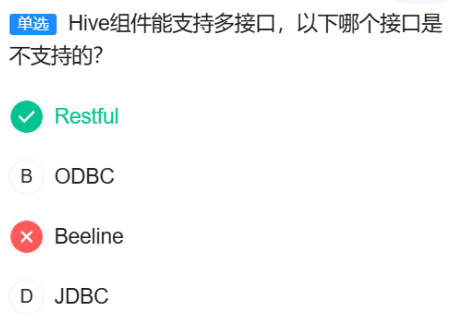
- Hive 是构建在 Hadoop 之上的一个数据仓库工具。
背景：HDFS 里存了海量数据，但想用传统的 SQL 去查询分析这些数据非常困难。
Hive 的作用：它把结构化的数据文件映射成一张数据库表，并提供了一种类似于 SQL 的查询语言，叫做 HQL。

## Hive 中的数据组织模型：分区和分桶[# 261]()。
### 分区
是什么--：按某一列的值（如日期、地区）将大表分割成不同的子目录。
为什么：为了快速过滤。查询时只需扫描相关分区目录，避免全表扫描。
特点：
物理上是目录。
==数量不固定，随数据增加==。
例子：按 dt=20231027 分区，所有这天的数据都在 /dt=20231027/ 这个目录下。
### 分桶
是什么：在分区内（或整个表），按某列值的哈希结果将数据分散到==固定数量的文件==中。
什么：为了提高采样和连接效率。数据被均匀打散，便于快速定位。
特点：
物理上是文件。
数量固定，建表时指定。
例子：按 user_id 分32个桶，ID为123的用户数据一定在某个特定编号的文件里。

### 问：为什么“桶”对应的物理结构是“文件”，而不是“目录”？
答：当Hive执行分桶时，它会：
计算分桶列的哈希值
根据桶数取模，确定这条记录属于哪个桶
==将属于同一个桶的所有数据写入同一个文件==


# 260
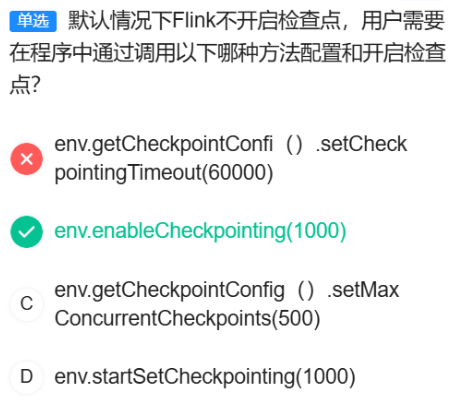

# 262
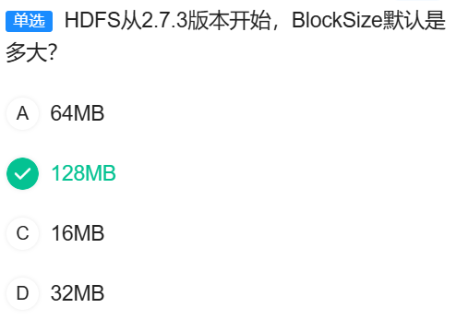

# 265
Kafka 的设计哲学是作为一个统一的、集中的实时数据管道，所有生产者和消费者都连接到这里。最佳实践是==避免创建多个 Kafka 集群进行级联==，因为这会增加复杂性和延迟。

# 266 
## 问：Topic 是什么？
可以把 Kafka 想象成一个消息系统或数据流通的管道。
Topic（主题） 就是这条管道中，对不同类型数据进行分类的标签。
一个生动的比喻：报社
Kafka 集群 = 整个报社
Topic = 不同的报纸专栏（比如：体育专栏、财经专栏、娱乐专栏）
消息 = 一篇篇的新闻报道
生产者 = 记者，他们撰写稿件并投递给特定的专栏。
消费者 = 读者，他们订阅自己感兴趣的专栏来阅读新闻。
所以：
“每条发布到Kafka的消息都有一个类别，这个类别被称为Topic” —— 这句话完全正确。就像每篇新闻稿都必须属于一个专栏。

## 答案解析
A. 每个Topic只能被分成一个partition(区)
不正确。这是对 Partition 概念的严重误解。
Partition（分区） 是 Topic 的细分，用于并行处理和提高吞吐量。
一个 Topic 可以被分成多个 Partition（比如10个，100个），这是 Kafka 实现高并发和高可用的核心机制。
说“只能被分成一个”是完全错误的。
B. 每个Partition在存储层面对应一个log文件，log文件中记录了所有的消息数据
正确。在 Kafka 的每个 Broker（服务器）上，每个 Partition 物理上就是一个有序的、只能追加的日志文件。所有发送到这个 Partition 的消息都按顺序记录在这个文件里。
C. 每条发布到Kafka的消息都有一个类别，这个类别被称为Topic，也可以理解为一个存储消息的队列
正确。这正确定义了 Topic，如上文的报社比喻。
D. Topic的Partition数量可以在创建时配置
正确。在创建 Topic 时，num.partitions 是一个关键的配置参数，用于指定这个 Topic 应该被分成多少个 Partition。

# 267
## MapReduce 编程模型的基础知识。
在 MapReduce 中：
Map 阶段：处理输入数据，输出中间结果。
Shuffle 阶段：根据 Key 将 Map 输出的中间结果进行排序、分组，然后分发到不同的 Reducer。
Reduce 阶段：每个 Reduce 任务处理分配给它的那一部分中间数据。每个 Reduce 任务会生成一个独立的输出文件。
关键规则： 一个 Reduce 任务对应一个输出文件。
因此，题目中明确指出有 5 个 Reduce 任务，那么最终就会产生 5 个输出文件。

# 269
A、这不是传统数据处理的瓶颈，因为它根本不是传统数据处理的目标。
传统数据处理（如 nightly ETL、T+1报表）的核心模式是批处理。它的设计目标就是处理已经存在的、静态的、成批的数据。
它本身就没有被设计用来处理持续不断的流数据。所以，“无法实时写入流数据”不是它的“瓶颈”，而是它的固有特性。==一个东西不具备的功能，不能称之为瓶颈==。

# 270
## 什么是KDC?
KDC 是一个你和你想要访问的所有服务都共同信任的“超级安全中介”。它的唯一职责就是安全地为你和你要访问的服务“牵线搭桥”，分发用于安全通信的“钥匙”。
## 答案解析：
A. Kerberos==支持双向鉴别==，Kerberos的Server端通过返回Client发送的时间戳，向Client提供验证自己身份的手段
正确。这是 Kerberos 双向认证的关键步骤。客户端在向应用服务器发送的请求中包含一个认证器（Authenticator），其中包含时间戳。应用服务器解密后，会用自己的会话密钥加密这个时间戳并返回给客户端。客户端如果能正确解密并匹配，就证明了应用服务器的身份。

✅ B. 由KDC代为发送Authenticator和Session Ticket有效提高性能
错误。这是对协议流程的误解。

==Authenticator（认证器）是由客户端生成，并直接发送给应用服务器的，KDC 从不代为发送 Authenticator==。
==Session Ticket（服务票据，即 TGS）是由 KDC 生成并发送给客户端的，然后由客户端自己持有并在需要时发送给应用服务器。KDC 并不会“代为发送”给服务器。==

这个描述混淆了不同消息的发送方和接收方，因此是错误的。

C. 用于认证的Session key是short term key只在一次会话中有效，有效防止暴力破解
正确。会话密钥生命周期很短，仅在一次特定的客户端-服务器会话期间有效。即使被破解，危害也被限制在单次会话内，大大增强了安全性。

D. 每个请求都以时间戳进行标记，有效防止重放攻击
正确。客户端生成的 Authenticator 中包含一个时间戳。服务器会检查这个时间戳是否在可接受的时间窗口内，并缓存近期收到的时间戳。如果收到一个重复或过期的时间戳，请求就会被拒绝，从而有效防御重放攻击。

# 271

DataStream API 是用于流计算的，而不是批计算。SQL API 是高级 API，它既可以用于流计算也可以用于批计算。

# 272
Kafka 中的 Offset（偏移量）是一个 64 位整数，它是一个从 0 开始单调递增的 long 类型数字。它绝对不是 String 类型。所以A错。

# 273
## HBase中的Rowkey是什么？
RowKey 是 HBase 表中每一行数据的唯一标识符，相当于关系型数据库中的主键。它决定了你的数据存储在哪个区域，以及数据在硬盘上的排序顺序。

## 答案解析：
好的，我们彻底搞懂这些操作。就用刚才那个 **HBase用户表** 的例子。

**假设我们的表是这样的，RowKey是用户ID：**

| RowKey (用户ID) | info:name | info:phone |
| :--- | :--- | :--- |
| **user001** | 张三 | 13811111111 |
| **user002** | 李四 | 13922222222 |
| **user003** | 王五 | 13733333333 |

**业务需求：** 我们想通过手机号 `13922222222`，快速找到对应的用户ID（`user002`）。

---

### 1. Get - "精准抓取"

*   **是什么**：像用**字典查字**。你必须**知道要查的字的准确拼音（RowKey）**，然后直接翻到那一页。
*   **怎么用**：`Get("user002")`
*   **结果**：直接返回 `user002` 这一行的所有数据（李四，13922222222）。
*   **特点**：**速度极快**，是HBase最高效的查询方式。
*   **用在我们的需求上**：**行不通！** 因为我们不知道手机号`13922222222`对应的RowKey（`user002`）是什么。我们无法使用`Get`。

---

### 2. Scan + ValueFilter - "全库盘查"

*   **是什么**：
    *   `Scan`：像**把图书馆从A到Z所有书架全部翻一遍**。
    *   `ValueFilter`：你给图书管理员一个**标准**，比如“找出所有内容里提到‘孙悟空’的书”。
*   **怎么用**：`Scan` 整个表，然后设置一个 `ValueFilter`，条件是 `value = '13922222222'`。
*   **执行过程**：
    1.  HBase 从 `user001` 开始读。
    2.  检查 `user001` 这行的所有值，发现电话是 `13811111111`，不匹配，跳过。
    3.  读 `user002`，发现电话是 `13922222222`，匹配！返回这一行。
    4.  继续读完 `user003`...
*   **结果**：最终能找到 `user002`。
*   **特点**：**功能上可以实现，但性能是灾难！** 因为无论你的数据有多少（1万行还是10亿行），它都需要扫描**整个表**。就像为了找一个人而排查全国人口，太慢了。
*   **用在我们的需求上**：**不合适**，无法满足“快速查询”的要求。

---

### 3. 为什么选项A "Get与valueFilter同时使用" 是错误的？

这是一个**概念性错误**。

*   `Get` 操作是**基于已知的RowKey进行精确定位**的。它假设你已经知道你要哪一行了，所以它根本**不需要、也不支持** `ValueFilter` 这种“过滤”机制。
*   这就好比你说：“我知道这本书的**具体索书号是A123**，请帮我用`内容过滤`的方式找到它。” 这本身就是矛盾的。你既然都知道索书号了，直接去拿就行了，还过滤什么内容呢？

所以，`Get` 和 `ValueFilter` **不能同时使用**。选项A描述了一个不存在的操作。

---

### 4. 正确的解决方案：二级索引

这就像我们为图书馆**额外制作了一份按“书名”排序的索引卡片**。

*   **主表**（按用户ID排序）：
    | RowKey (用户ID) | info:name | info:phone |
    | :--- | :--- | :--- |
    | user001 | 张三 | 13811111111 |
    | user002 | 李四 | 13922222222 |
    | user003 | 王五 | 13733333333 |

*   **二级索引表**（按手机号排序）：
    | RowKey (手机号) | 用户ID |
    | :--- | :--- |
    | **13733333333** | user003 |
    | **13811111111** | user001 |
    | **13922222222** | user002 |

**现在，查询流程变成了：**

1.  在**索引表**里执行一次高效的 `Get("13922222222")`，瞬间得到结果：`user002`。
2.  在**主表**里再执行一次高效的 `Get("user002")`，瞬间得到用户的完整信息。

**这个过程只进行了两次毫秒级的 `Get` 操作，完全避免了全表扫描，真正实现了“快速查询”。**

---

### 总结

| 操作 | 类比 | 速度 | 解决我们需求？ |
| :--- | :--- | :--- | :--- |
| **Get** | 按学号查学生 | **极快** | **否**（不知道学号） |
| **Scan + ValueFilter** | 全校点名找叫“李四”的人 | **极慢**（全表扫描） | **功能可行，性能不可行** |
| **二级索引** | 先查《姓名-学号对照表》，再按学号查 | **快**（两次Get） | **是，最佳方案** |

所以，原题的正确选项是 **D. 创建二级索引**。它通过空间换时间，将非RowKey的查询转换成了高效的RowKey查询。

# 274 
>考察对 Flume Channel 特性的准确理解

A. Memory channel中消息存放在内存中，提供高吞吐，但可能丢失数据
正确。Memory Channel 将事件存储在内存队列中，读写速度极快，因此吞吐量很高。==但一旦 Flume Agent 进程异常终止，内存中尚未传输的数据就会全部丢失，可靠性低==。

✅ B. JDBC Channel内置的derby数据库，对event进行了持久化，但不提供高可靠性
错误。这是对 JDBC Channel 特性的矛盾描述。

JDBC Channel 使用内嵌的数据库（如 Derby）或外部数据库（如 MySQL）来持久化事件，将事件写入磁盘数据库。

正是因为将数据持久化到了数据库，它才能提供高可靠性，确保在 Agent 失败时数据不会丢失。

因此，正确的描述应该是：“...对event进行了持久化，因此提供高可靠性”。原选项后半句“但不提供高可靠性”是完全错误的。

C. Channel支持事务机制，提供较弱的顺序保证
正确。Flume Channel 支持事务（Put 事务和 Take 事务），这保证了单个批次的原子性。它只能保证在同一个 Channel 中，事件被处理的大致顺序，但不能提供严格的、强保证的顺序，尤其是在多个Source或Sink的情况下。

D. File Channel支持对数据持久化，但需要配置数据目录和checkpoint目录
正确。File Channel 通过将数据写入本地磁盘文件来实现持久化。配置时，必须指定 dataDirs（数据存储目录）和 checkpointDir（检查点目录，用于恢复状态），这是其标准配置要求。

# 275
==RDD：这是 Spark 最基础的数据抽象==。
特点：弹性、分布式、可并行操作。
缺点：Spark 引擎无法优化其执行过程，因为不知道数据的内部结构。性能相对较低。
==DataFrame：在 RDD 之上增加了 Schema（结构信息）==。
可以看作是 DataSet[Row]，即一个存放着 Row 对象的 DataSet。
特点：由于有了结构信息，Spark 的 Catalyst 优化器 可以对其执行计划进行深度优化（如谓词下推、列裁剪），Tungsten 执行引擎也能进行高效的列式内存管理和代码生成。
缺点：是弱类型的。在编译时无法发现类型错误，只能在运行时发现。
==DataSet：在 DataFrame 之上增加了 强类型==。
它是 DataFrame API 的扩展，提供了编译时类型安全。
特点：同时拥有 RDD 的类型安全 和 DataFrame 的性能优势。
它享受与 DataFrame 相同的 Catalyst 优化 和 Tungsten 高效执行。

# 280（没懂）
在华为云Stack中，在部署ManageOne平台时，需要部署多台虚拟机来进行管理和运维，其中ManageOne-Deploy是用来管理部署任务和管理模板的，ManageOne-Service是提供云服务管理功能的，ManageOne-vAPP是提供虚拟机应用平台服务的，ManageOne-Tenant是用来管理租户的。因此，选项C不是安装时必须安装的管理虚拟机。因此，答案是C.ManageOne-vAPP。
# 281
OpenStack 是一个开源的、用来构建和管理公有云、私有云基础设施的云操作系统。
# 290

# 291
A. VDC管理员
可以管理。VDC管理员在其负责的虚拟数据中心内拥有较高的管理权限，包括管理和部署资源栈，以服务于该VDC内的业务需求。
✅ B. VDC业务员
无法管理。这个角色的权限通常是最低的，主要限于使用已经部署好的云资源（如开关虚拟机、使用云硬盘），而没有权限去创建、修改或删除整个资源栈。资源栈管理属于基础设施的编排和自动化部署范畴，超出了业务员的操作范围。
C. 代维管理员
可以管理。代维管理员是受委托代表其他VDC进行运维操作的角色，通常被授予了相应的权限，可以管理其代维范围内的资源栈。
D. 运营管理员
可以管理。运营管理员是全局性的高级管理员，拥有整个云平台的最高权限，自然可以管理任何资源栈。
## VDC的级别：一级和二级
华为云Stack通常采用分层级的VDC模型，这类似于公司的组织架构：
**一级VDC**：
对应总公司或集团。
一级VDC管理员拥有最高级别的管理权限，可以从运营管理员那里接收整个集团的资源配额。
他们可以将配额和资源向下分发给多个二级VDC。
**二级VDC**：
对应子公司或业务部门（如“华为云北京研发部”、“华为云市场部”）。
二级VDC管理员从一级VDC管理员那里获得配额，然后管理自己部门内部的资源分配和用户。
## 什么是VDC管理员？
VDC管理员 是华为云Stack中为了实现企业级多级资源管理和分权分域而设定的一个角色。我们可以把它理解成云资源的企业内部“总经理”或“部门负责人”。
## 什么是资源栈？
资源栈 = 通过模板自动化创建出来的一整套、有逻辑关联的云应用环境。
# 293
A. Swift管理副本的粒度是对象
正确。Swift 确实是以“对象”为单位来管理其副本的。当你上传一个文件（对象），系统会为这个特定的对象创建多个副本。
B. 每个副本存放在不同的Zone中
错误。这是对副本放置策略的过度绝对化描述。
Zone 是 Swift 中一个容错单元，可以理解为一个机房、一个机架或一组磁盘。
Swift 的副本放置策略目标是 “将副本分散到不同的故障域”，其核心是保证副本在不同的节点上。
最佳实践确实是将副本放置在不同的 Zone 中以提供更高的可靠性，但这不是强制要求。在一个小型部署中，可能只有一个 Zone，那么所有副本就只能存放在同一个 Zone 的不同节点上。
因此，说“每个副本都存放在不同的 Zone 中”是不准确的。
C. 对象的副本是通过Partition的副本来实现的
正确。这描述了 Swift 底层的实现机制。
Swift 不是直接复制整个文件，而是将对象数据切分成更小的块，这些块分布在不同的分区中。
数据的可靠性是通过保证这些分区有多个副本来实现的，从而间接保证了对象本身的多个副本。
D. Swift为每个对象都建立了一定数量的副本
正确。这是 Swift 保证数据可靠性的核心机制。默认情况下，一个对象会有 3 个副本，分布在不同的存储节点上。

# 294


# 295
A. 用户可以对文件系统进行管理，包括容量调整、查看、卸载、还原、删除文件系统等
正确。这是SFS提供的基本管理功能，用户可以通过控制台或API对文件系统进行全生命周期管理。

✅ B. SFS至多可以弹性伸缩至TB规模
错误。这个描述严重低估了SFS的扩展能力。

华为云SFS的弹性文件服务（特别是高性能型/SFS Turbo）可以轻松扩展至PB（Petabyte）级别，而不仅仅是TB（Terabyte）级别。

1 PB = 1024 TB，因此说“至多TB规模”是一个明显的错误，没有体现出SFS的海量扩展能力。

C. 使用弹性文件服务前，必须要创建一个文件系统
正确。这是使用任何文件服务的基本前提。用户需要先创建文件系统实例，然后才能挂载和使用。

D. 创建文件系统后，您需要将文件系统挂载至云服务器才能使用
正确。文件系统创建后，需要像挂载硬盘一样，将其挂载到ECS云服务器上，然后才能在服务器上像使用本地目录一样访问文件系统。

# 297
✘ A. 瓶颈分析
能满足。这是典型的全局运维场景。运营者需要找出整个云平台中性能的瓶颈点，例如：哪些物理主机的CPU使用率持续过高？存储IOPS是否达到上限？这能帮助其进行优化和扩容，保障平台整体性能。

B. 闲置分析
能满足。这是重要的成本优化场景。运营者需要从全局视角找出那些被分配但长期未被使用的资源（如空闲的云主机、未被挂载的云硬盘），并将其回收或重新利用，以提高整个平台的资源利用率和经济效益。

✔ C. 应用分析
不能满足。应用分析通常指的是对部署在云平台上的某个具体业务应用的性能、调用链、用户体验等进行深入分析（例如使用APM工具）。这属于租户视角或业务运维视角的范畴，而不是云平台运营者进行基础设施全局管理的核心诉求。ManageOne作为云管理平台，其主要职责是管理“云资源”，而非深入到租户的“业务应用”内部。

D. 容量分析
能满足。这是最核心的全局分析场景之一。运营者需要基于历史数据和趋势，预测未来计算、存储、网络资源的消耗情况，以便进行准确的容量规划，避免资源耗尽的风险。


# 298
✅ A. 审批流程
不属于日常运维。审批流程的创建、配置和管理属于系统管理或运营管理的范畴。它是一项事前设定的规则和策略，而不是运维人员每天需要执行的例行性维护工作。日常运维关注的是系统的运行状态、稳定性和数据安全，而不是审批规则的设定。

B. 备份管理
属于日常运维。这是运维的核心职责之一，包括定期为系统数据和配置创建备份、检查备份是否成功、验证备份数据的可用性等，以确保在发生故障时能够快速恢复。

C. 自动作业
属于日常运维。运维人员会创建和管理自动作业，用于执行周期性的维护任务，例如定时清理日志、定期执行健康检查、在凌晨进行数据同步等，以实现运维的自动化和规范化。

D. 健康巡检
属于日常运维。这是最典型的日常运维工作。运维人员需要定期（如每天或每周）检查系统中各个服务和组件的状态、性能指标、日志是否存在错误、资源使用率等，以便及时发现潜在问题并处理，防患于未然。

## 问：“华为Stack”中审批流程的作用是什么？
审批流程 是在一个组织内部，为了对某项申请进行审核和批准而预设的、标准化的步骤序列。它确保了重要的请求能够按照公司的制度和权限，由正确的人进行核查和决策。
想象一下，你要申请一笔项目经费，公司规定了一套固定的流程，就像一张需要逐级盖章的“申请表”
# 299
A、现代的企业级云管理平台，包括ManageOne，为了与企业现有的ITSM流程集成，通常都支持与外部审批系统的对接。它可以通过API接口或工作流引擎调用外部系统的审批流程，实现审批过程的统一管理。因此，说“不支持”是不准确的。
C、运营管理员是最高级别的租户管理员，其创建的审批流程属于全局性配置，对整个云平台的所有VDC都可见可用。
D、 VDC管理员或代维管理员创建的审批流程在本VDC及下级VDC内可见
正确。这体现了审批流程的作用域概念。VDC管理员创建的流程，其权限范围被限定在其管理的VDC及下级VDC内，实现了多租户环境下的权限隔离和管理自治。

# 304
C、不同区域下其他 VPC 可以通过在各自 VPC 内创建的终端节点，与终端节点服务之间通过弹性 IP 建立连接 → ❌ 错误，因为跨区域时，终端节点本身不支持直接通过 EIP 连接终端节点服务，跨区域访问需要其他方案（如 VPC Peering + 公共访问或 API Gateway 等），不是标准终端节点功能。
https://blog.csdn.net/m0_58881902/article/details/143275096中有提到 

# 307（存疑）其实我感觉应该选择D）代维管理员
## 认识选项中的各个角色
好的，我们来详细解析第一题中出现的四个角色及其典型任务，这能帮助我们更清晰地理解为什么**代维管理员**无法创建企业项目。

---

### **角色任务详解**

#### **1. 运营管理员**

*   **角色定位**：云平台的**最高运营者**和**全局管理者**，相当于云平台的“总负责人”。
*   **核心任务**：
    *   **全局资源管理**：管理整个云资源池（计算、存储、网络）的容量和健康状况。
    *   **基础服务管理**：审批和上架云服务市场中的服务，供租户使用。
    *   **顶层设计与配额分配**：
        *   **创建企业项目**，作为顶层资源管理和财务核算的单元。
        *   为**一级VDC**分配总体的资源配额和预算。
    *   **全局策略制定**：定义全局的安全策略、监控告警策略、计费策略等。
    *   **多租户管理**：管理整个平台上的所有VDC和用户。

*   **与“创建企业项目”的关系**：这是他的**核心职责**之一，他需要从平台顶层规划资源，建立企业治理框架。

---

#### **2. 一级VDC管理员**

*   **角色定位**：大型组织（如集团总部、大型子公司）的**云资源总管理员**，相当于“集团CIO”。
*   **核心任务**：
    *   **接收上级资源**：从**运营管理员**那里接收集团的总资源配额和预算。
    *   **内部资源规划**：
        *   **创建企业项目**，用于管理跨部门的重大项目或进行内部财务核算。
        *   创建**二级VDC**，并将配额分配给下属的各个部门或子公司。
    *   **内部审批流程**：定义集团一级的资源申请审批流程。
    *   **成本与监控**：监控整个一级VDC及其下所有二级VDC的资源使用情况和成本。

*   **与“创建企业项目”的关系**：他需要在集团内部进行资源规划和项目管理，因此**有权创建**企业项目。

---

#### **3. 二级VDC管理员**

*   **角色定位**：具体部门或项目组的**云资源管理员**，相当于“部门IT经理”或“项目经理”。
*   **核心任务**：
    *   **接收部门资源**：从**一级VDC管理员**那里领取本部门的资源配额。
    *   **服务分配**：将具体的云服务（如ECS、EVS）分配给部门内的**VDC业务员**（普通用户）使用。
    *   **部门级审批**：管理本部门内部的资源申请审批流程。
    *   **项目管理**：
        *   **创建企业项目**，用于管理其部门内的特定项目，并控制项目资源消耗。
    *   **用户管理**：管理本VDC内的用户账号和权限。

*   **与“创建企业项目”的关系**：他需要管理其部门内的多个项目，因此也**有权创建**企业项目来隔离和管理这些项目。

---

#### **4. 代维管理员**

*   **角色定位**：由**合作伙伴**或**专门的运维团队**担任的**技术运维角色**，相当于“外包的运维专家”。
*   **核心任务**：
    *   **运维操作**：根据授权，对云资源进行日常的**运维和管理**，如重启虚拟机、扩容磁盘、查看监控数据、处理告警等。
    *   **技术支持**：解决平台运行中遇到的技术问题。
    *   **权限特点**：其权限通常是**操作权限**，而非**管理权限**。他们可以“操作”已经存在的资源，但通常无权“规划”和“分配”资源。
*   **与“创建企业项目”的关系**：
    *   **创建企业项目**是一个**资源规划和治理**行为，而不是一个**技术运维**操作。
    *   代维管理员的职责范围不涉及企业的组织架构设计、项目划分和资源配额分配。他们的工作是保证已经分配好的资源能够稳定运行。
    *   因此，该角色**没有被授予**创建企业项目的权限。

---

### **总结对比**

| 角色 | 核心任务焦点 | 能否创建企业项目 | 原因 |
| :--- | :--- | :---: | :--- |
| **运营管理员** | **平台全局**运营与规划 | **✅ 能** | 需要从顶层进行资源规划和建立治理框架 |
| **一级VDC管理员** | **组织内部**资源规划与分配 | **✅ 能** | 需要在组织内管理跨部门的项目和资源 |
| **二级VDC管理员** | **部门内部**资源管理与分配 | **✅ 能** | 需要管理部门内的多个项目 |
| **代维管理员** | **技术运维**与支持 | **❌ 不能** | 职责是运维操作，不涉及资源规划与组织管理 |

这个设计体现了华为云Stack在权限上的 **“权责分离”** 原则：**规划权**和**运维权**是分开的，使得平台管理更加清晰、安全且符合企业治理规范。

# 308（感觉解析有问题）
D、华为云Stack是基于开源OpenStack，但作为企业级产品，不会简单地把最新开源版本每半年一次直接同步到客户现网，因为新版本可能不稳定，企业环境需要经过严格测试、定制、验证后才升级，否则会破坏稳定性。直接保证“最新开源特性同步至客户现网”是不符合企业级产品审慎升级策略的。


# 309
华为openstack知识：https://www.cnblogs.com/vorn/p/17561386.html

# 315
## 答案解析
A 已过期的私有镜像可以用于申请云硬盘，但不可以用于申请弹性云服务器
→ 错误，过期镜像通常不能用于创建新资源。
B 软删除的私有镜像不能用于申请裸金属服务器，但可以用于申请弹性云服务器
→ 错误，软删除后通常所有新建都不允许。
C 软删除的私有镜像不能用于申请云硬盘，但可以用于申请弹性云服务器
→ 错误，软删除后都不能用。
D **裸金属服务器不支持使用私有镜像创建，仅支持使用公共镜像创建**
→ 正确（在某些版本或场景下如此，可能是华为云Stack的限制）。
## 什么是软删除？
软删除，也称为“回收站”机制，是指当用户执行删除操作时，系统并不会立即永久删除该资源，而是先将其放入一个“已删除”或“回收站”状态。

# 316（存疑）

# 317
## Horizon是什么？
身份：OpenStack的官方Dashboard项目。
形式：一个基于Web的图形化界面。
目的：为云用户和管理员提供一种直观、无需命令行的方式来查看、申请、管理和销毁云资源。

## 常见的Horizon界面操作示例
让我们回到您之前做过的题目，这些题目本身就是对“Horizon界面操作”的最佳诠释：
- 创建虚拟机：
在界面上点击 创建实例 -> 输入名称 -> 选择镜像 -> 选择规格 -> 选择网络 -> 点击 启动。
- 管理配额：
管理员在 管理员 -> 系统 -> 默认配额 中，可以修改项目在计算、存储、网络等方面的资源上限。
- 管理镜像：
在 计算 -> 镜像 中，可以查看公共镜像、上传自己的私有镜像、删除或修改镜像属性。
- 创建卷（云硬盘）：
在 卷 -> 卷 中，点击 创建卷，指定大小和类型，然后将其挂载到虚拟机上。
- 网络管理：
在 网络 -> 网络 中，创建私有网络、子网、路由器和安全组规则。
## 答案解析：
A 管理员在Horizon界面中创建实例时，若创建新卷选择否，代表会使用临时存储
→ 正确。
B 管理员可以在Horizon界面中自定义添加Dashboard和Panel
→ 错误，Horizon 的 Dashboard 和 Panel 需要修改代码并重启服务，不能在界面上直接添加。
C 管理员可以在Horizon界面中自定义计算、存储、网络的配额
→ 正确。
D 管理员可以在Horizon界面中删除使用命令行创建的Role
→ 正确。

# 318 
## Keystone 是什么？
Keystone 是OpenStack的身份认证服务，也被称为“OpenStack Identity Service”。它是所有OpenStack服务的入口，是整个云系统的安全大脑和总调度中心。


# 319
## 答案解析
nova-api在接收到创建或者删除虚拟机的请求后，不需要nova-conductor和nova-scheduler服务的参与来完成相应请求
## 有关Nova的知识
网址：https://cloud.tencent.com/developer/article/2375626
Nova 是 openstack 中最早出现的模块之一，主要是为openstack提供计算服务。在openstack中，Nova又分为**计算节点**和**控制节点**。我们**把安装有nova-compute的节点称为计算节点，其他的节点称为控制节点**。**nova的计算节点只负责创建虚拟机，而nova的控制节点负责控制**。

### Nova 系统架构
Nova 由多个服务器进程构成，每个进程执行不同的功能，下面介绍各个组件的功能。
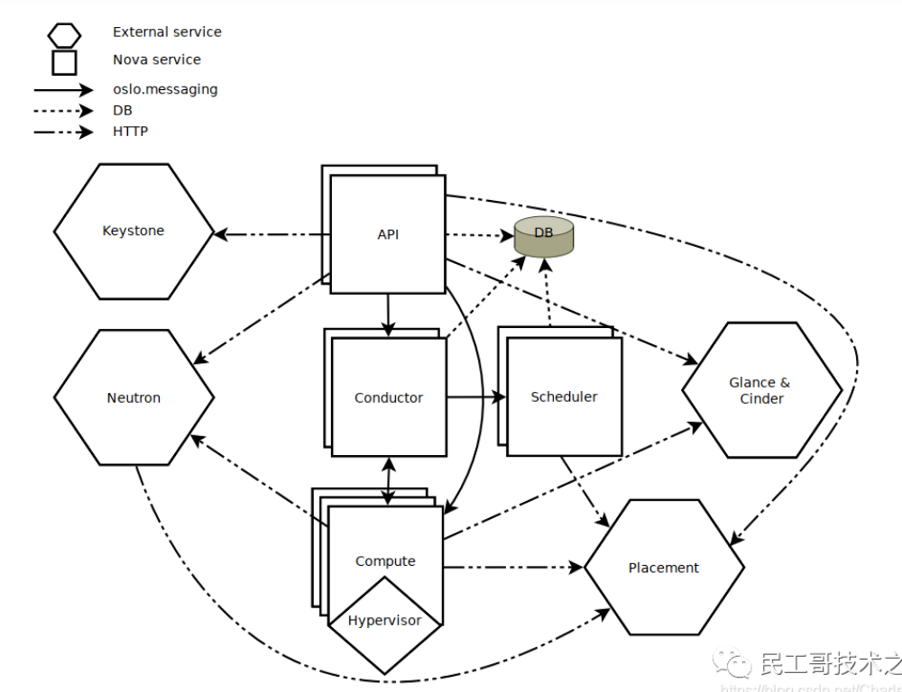
nova-api：接收 rest 消息，包括 HTTP 请求，服务间通信。
nova-scheule：选择合适的主机。
nova-conductor：数据库操作和复杂流程控制。
nova-compute：虚拟机生命周期管理和资源管理，负责处理虚机和 hypervisor 间的通信。
db:sql 数据库存储nova相关的业务数据。


# 320（存疑）
## 问：为什么主机组一般只配置一种资源类型？
>什么是资源类型?
在华为云Stack中，“资源类型”通常指主机的硬件能力类别，例如：
通用计算：标准的CPU和内存配置，满足大多数业务场景。
GPU加速：配备了GPU卡，用于图形处理、AI训练、科学计算等。
高性能计算：配备了高速网络（如InfiniBand）和特定CPU，用于大规模并行计算。
大内存型：配置了超大容量内存，用于内存数据库（如SAP HANA）等场景。

>主机组一般只配置一种资源类型调度逻辑的好处如下：
**简化调度逻辑**
运营管理员在创建虚拟机规格（Flavor） 时，必须指定该规格所需的资源类型（例如，“GPU型”）。当用户使用该规格创建虚拟机时，调度器（Nova-scheduler）的过滤规则很简单：只寻找资源类型为“GPU型”的主机组。如果主机组混合了多种资源类型，调度器将无法可靠地进行筛选，调度过程会变得复杂且容易出错。

## 答案解析
A 一台虚拟机有且只有一个规格，一个规格可以被多台虚拟机同时使用
→ 正确，规格是模板，可以被多台VM使用。
B 一台主机可以加入多个主机组，但要求主机满足主机组的CPU模型配置
→ **也有可能是对的**
C 主机组可以同时配置多种资源类型，在运营面创建虚拟机时应当手动选择所需资源类型的主机组
→ 错误，主机组一般只配置一种资源类型（如通用计算、GPU、高性能计算等）。
D 为避免同一大小规格重复创建，建议在规格创建时勾选多种资源类型
→ 错误，一个规格一般只对应一种资源类型。
# 321（存疑）

# 322（存疑）（C选项看不懂）
A. Swift采用完全对称、面向资源的分布式存储架构设计，所有组件都可扩展，避免因单点失效而扩散并影响整个系统运转
正确，==Swift 是对称架构，无单点==。
B. 每个openstack服务内部是由多个进程组成。所有服务（Keystone除外）都至少有一个API进程，负责监听API请求。对请求进行预处理并将它们传递给服务的其他部分
基本正确，Keystone 也有 API 进程，但这里说“Keystone除外”可能是早期版本或特定说法，但不算明显错误。
C. 在部署OpenStack云时，对于一个服务中不同进程之间通信所使用的的消息队列和数据库的选择方案是一一对应的
这个说法可疑。==一个 OpenStack 服务（如 Nova）的不同进程（api, scheduler, conductor, compute）都使用同一个消息队列和数据库==，不是“一一对应”不同队列或数据库。因此这个表述容易误导，可能是错误选项。
D. Nova对请求应答进行异步调用，当请求接受后立即触发一个回调，由于使用了异步通信，不会有用户的动作被长置于等待状态
这是 OpenStack 常见异步机制（通过消息队列）的描述，基本正确。

## D选项的详细解读：
>什么是异步调用？什么是异步机制？

### 核心概念解释
#### 1. 异步调用与同步调用
- **同步调用**：就像你打电话给客服，你必须拿着电话一直等，直到客服帮你处理完问题、给出答案，你才能挂电话。在这期间，你几乎不能做别的事情（在这个上下文中，你的程序或用户界面会“阻塞”等待）。
- **异步调用**：就像你给客服留了一个语音邮件或提交了一个工单。你一旦提交完，就可以立刻挂断电话去做别的事情了。之后，客服会在处理完你的请求后，通过某种方式（比如回电或发邮件）通知你结果。

在 OpenStack Nova 中，创建虚拟机这种操作是复杂的，需要调度资源、在指定计算节点上创建、拉取镜像、配置网络等，耗时较长。如果采用同步调用，用户的浏览器或客户端会一直转圈等待，体验极差且容易超时。
#### 2. 异步通信
这是实现异步调用的**技术手段**。它指的是两个系统或组件之间进行通信时，发送方发出消息后**不立即等待接收方的回复**，而是继续执行自己的任务。回复会在将来某个时间点，通过另一种机制（如回调、事件通知）送达。

在 OpenStack 中，**消息队列（如 RabbitMQ, Kafka）** 就是实现异步通信的核心组件。各个服务（如 Nova-api, Nova-scheduler, Nova-compute）通过向消息队列发送和接收消息来协同工作，而不是直接进行 HTTP 调用。
---
### 对题目中描述的逐句解析
**“Nova对请求应答进行异步调用”**
- 当用户通过 `nova boot` 命令或 Horizon  dashboard 点击创建虚拟机时，这个请求首先到达 **Nova-API** 进程。
- Nova-API 不会自己完成所有创建任务，它只负责验证请求、解析参数。然后，它会立即向消息队列发送一条消息，并将一个任务“委派”出去。
**“当请求接受后立即触发一个回调”**
- 这里的“触发一个回调”描述可能不够精确，但核心思想是：Nova-API 在验证请求合法并放入消息队列后，会**立即向用户返回一个响应**，这个响应通常是“**202 Accepted**”和一个代表此次创建操作的 **任务ID** 或 **虚拟机ID**（此时虚拟机还未真正创建）。
- 这个“立即返回”的动作，可以理解为一种广义的“回调”机制的起点——它告诉用户：“你的请求我已收到，正在处理，这是你的凭据，你可以用这个凭据去查询进度。”
**“由于使用了异步通信，不会有用户的动作被长置于等待状态”**
- 这是异步模式带来的**核心优势**。
- 用户（或用户的客户端）在收到 `202 Accepted` 响应后，就不会再保持一个长时间的连接等待了。用户可以立即进行其他操作，比如：
    - 使用返回的虚拟机ID去周期性地查询虚拟机的创建状态（`nova show <server_id>`）。
    - 去创建其他资源。
- 在后台，Nova 的各个组件（Scheduler, Compute）通过消息队列接收任务并一步步执行。整个过程可能持续几十秒甚至几分钟，但这都与用户的前端请求无关了。
---
### 总结
这句话描述的是 OpenStack Nova 为了处理耗时较长的任务（如创建虚拟机），而采用的**基于消息队列的异步架构**。

- **异步调用**是行为模式：发出请求，不等待结果，立即返回。
- **异步通信**是实现方式：通过消息队列传递任务，而非直接的请求-响应。
- **最终效果**：提升了系统的响应速度、吞吐量和用户体验，用户不会因为一个长时间的后台任务而卡在等待界面。
  
# 323
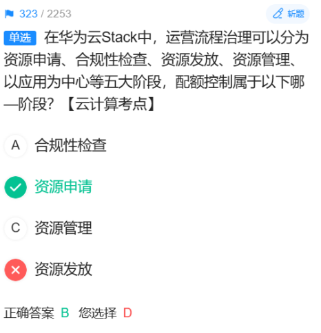

# 324
## 解析
公共镜像：云平台官方提供，对所有用户可见。
共享镜像：由其他用户共享给当前用户，对当前用户可见。
私有镜像：用户自己创建或导入的镜像，对自己可见。
管理镜像：这是管理员在后台维护的镜像，可能用于系统内部用途或特定权限场景，普通用户无法看到或使用，因此对普通用户不可见。
## 为什么普通用户不能访问管理镜像？
因为管理镜像可能包含：
敏感的系统模板或商业镜像，不对外公开。
用于云平台内部运维的镜像。
需要特定权限或付费合约才能使用的镜像。
为了安全和权限分离，普通用户只能看到被授权使用的镜像（公共、共享、私有），而管理镜像仅对管理员可见。
# 325


# 326
## 解析
典型的数据流：采控层（数据采集）→ Kafka（消息队列）→ Flink（流计算）→ Elasticsearch（存储/检索）→ 上层应用查询。
选项 A 说“从采控层获取的数据经过预处理上报至Kafka”是错误的，因为==预处理一般是在流处理引擎（如Flink）中做的==，而不是在进入 Kafka 之前就做聚合计算和维度补齐。
# 327
TaskCenter 是华为云Stack中的任务调度与管理系统，负责批量作业、自动化运维任务等。
它的外部依赖包括：
NTP（时间同步，必须）
ICAgent（采集监控数据，用于任务状态监控）
IAM（身份与访问管理，鉴权）
DMK（Database Management Kit，数据库管理工具）并不是 TaskCenter 的直接外部依赖，所以选 D。

# 328
## 问：为什么default 安全组默认规则是允许所有出口、拒绝所有入口？为什么要这么设计？
**确保初始安全性**。当一个新项目或新用户创建第一台云主机时，他可能对网络安全一无所知。如果默认设置是 “允许所有入口”，那么这台云主机一创建就可能暴露在互联网上，极易被攻击。
反面教材：早期的某些系统可能默认允许所有流量，导致用户在没有配置安全组的情况下就遭受入侵。
正面做法：OpenStack 选择了一个 “最小权限原则” 的起点：默认情况下，云主机什么也收不到（拒绝所有入口），但它可以主动发出任何请求（允许所有出口）。这为系统提供了一个安全的基础。
# 329
了解thick和thin模式就很好解决这题。
好的，简单介绍一下 OpenStack 中 **Thick Provisioning（厚置备）** 和 **Thin Provisioning（ thin 置备）** 这两种磁盘分配模式。

你可以把它们想象成在订酒店时分配房间的两种不同策略：
---
### **1. Thick Provisioning（厚置备 | 预分配）**
*   **核心思想**：**“一次性给足”**。
*   **工作方式**：当你创建一个 100GB 的云硬盘时，存储后端会**立刻、实实在在地**划出 100GB 的物理空间分配给你。无论你最终用了 1GB 还是 50GB，这 100GB 从创建那一刻起就被你独占，别人无法使用。
*   **类比**：就像你订了一个 50 平米的酒店房间，无论你是一个人住还是一家人住，这个 50 平米的房间在入住期间都完全属于你，酒店不能再把它卖给别人。
*   **优点**：
    *   **性能稳定**：空间预先分配，写入新数据时无需再分配空间，性能通常更好、更稳定。
    *   **数据安全**：由于空间独占，不存在因为超额分配而导致磁盘写满的风险。
*   **缺点**：
    *   **空间利用率低**：如果你只用了 10GB，那么剩下的 90GB 就白白浪费了，无法被其他云硬盘使用。
---
### **2. Thin Provisioning（ thin 置备 | 精简分配/超分配）**
*   **核心思想**：**“用多少，给多少”**。
*   **工作方式**：当你创建一个 100GB 的云硬盘时，存储后端只是在“账本”上记录你**最多可以**用 100GB，但并不会立即分配物理空间。只有当你真正往磁盘里写入数据时（比如写了 5GB），存储系统才会**按需**分配 5GB 的物理空间给你。
*   **类比**：就像你订了一个“最多可住 10 人”的套房，但酒店只根据实际入住人数来准备床位和毛巾。如果只有 2 人入住，酒店就可以把剩下的资源（8个床位）临时卖给其他客人。
*   **优点**：
    *   **空间利用率极高**：极大地节省了存储空间，允许创建总容量远超物理磁盘总容量的多个云硬盘（这被称为“超额分配”）。
*   **缺点**：
    *   **性能波动**：每次写入新数据都可能触发一次空间分配操作，可能会引入微小的性能开销。
    *   **有耗尽风险**：如果所有用户同时大量写入数据，物理空间可能被瞬间耗尽，导致所有人的云硬盘都无法写入，风险较高。
---
### **总结对比**

| 特性 | Thick Provisioning（厚置备） | Thin Provisioning（ thin 置备） |
| :--- | :--- | :--- |
| **分配方式** | 创建时一次性全部分配 | 按需分配，用时才给 |
| **空间利用率** | 低 | **高** |
| **性能** | **更稳定** | 可能有轻微波动 |
| **风险** | 空间浪费 | **物理空间耗尽风险** |
| **适用场景** | 对性能要求高、稳定的企业应用 | 追求资源利用率、开发测试环境 |

在华为云Stack或任何云平台中，管理员可以根据业务需求（是追求性能还是追求容量）来选择为不同的存储资源池配置哪种分配模式。

# 330（存疑）（原题答案和原题解析自相矛盾）
## AI回答
用户名、组名、项目名、角色名在 全局（整个Keystone）必须唯一，不只是域内唯一。

# 331
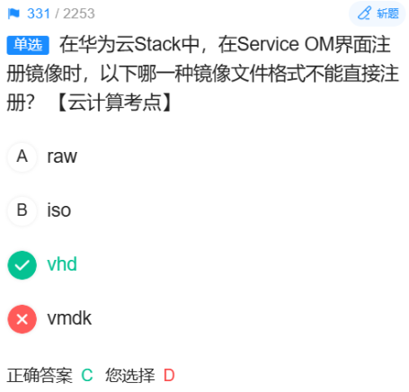
# 332（存疑）
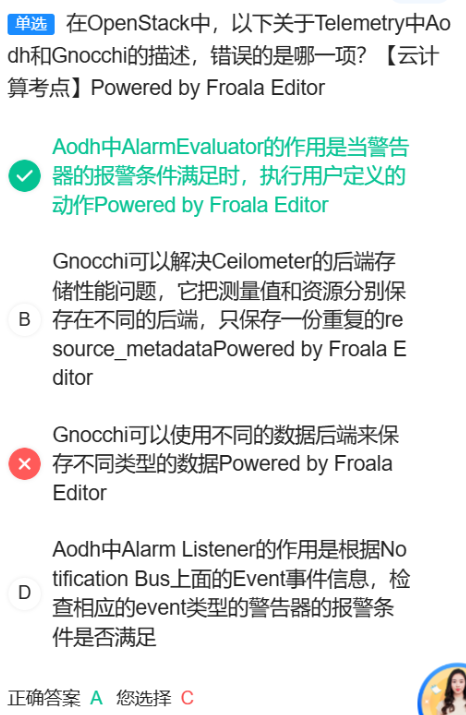
选项C错误的原因：
Gnocchi是一个时序数据库，它主要用于存储和检索时间序列数据。Gnocchi确实支持使用不同的数据后端来存储数据，但这并不是它的核心功能或主要设计目的。Gnocchi的主要目的是提供一个高效的方式来存储和查询大规模的时间序列数据，而不是简单地支持多种数据后端来存储不同类型的数据。

# 333
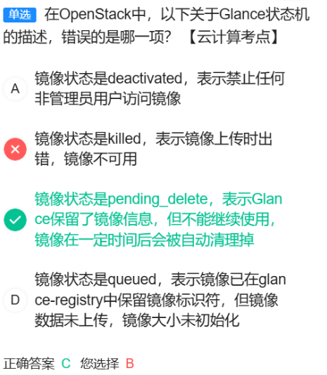
## 解析
镜像状态是pending_delete，表示Glance保留了镜像信息，但不能继续使用，镜像在一定时间后会被自动清理掉。

# 334
## 答案解析：
A. 按区域（个人理解：这更多是==云服务提供商==要考虑的，本题可能是要站在==用户==的角度进行分析。作为用户，我们要使用的资源已经被云服务商在==逻辑上==集中起来了。）
B. 按VDC：VDC（Virtual Data Center）虚拟数据中心，也是云资源管理和分析的一个常见维度。
C. 按应用：按应用进行资源分析和瓶颈分析也是常见的，因为不同的应用可能会有不同的资源需求和性能瓶颈。
D. 按资源池：资源池是云环境中用于管理和分配资源的一种方式，按资源池查看也是常见的分析维度。
## 什么是资源池？
资源池（Resource Pool）是云计算和虚拟化技术中的一个概念，它指的是将计算资源（如CPU、内存、存储和网络带宽等）集中起来，形成一个可以动态分配和共享的资源集合。

# 335
## HOT模板模版？
HOT（Heat Orchestration Template）是OpenStack Heat服务使用的模板格式，==用于描述云资源的部署和配置==。
## 答案解析：
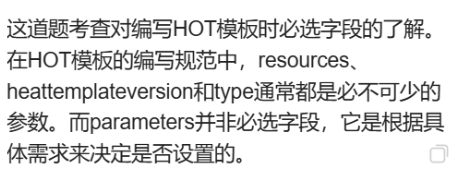

# 336
## 对Ceilometer进行认识（注意与“知识体系”中的第一个知识点进行联系）
### 前言
Transformer 是 Ceilometer 数据处理管道中的一个核心功能单元，负责在原始监控数据被持久化存储或发送给下游系统之前，对其进行加工、清洗和转换。

**数据管理与您列出的发放实例组件有直接且重要的关系。** 简单来说，Ceilometer就像是整个云平台的“**审计和计费数据收集系统**”，它监控和记录着您列出的所有组件在执行任务时产生的资源消耗数据。

**Ceilometer与“知识体系”中的第一个知识点进行联系如下图所示**：

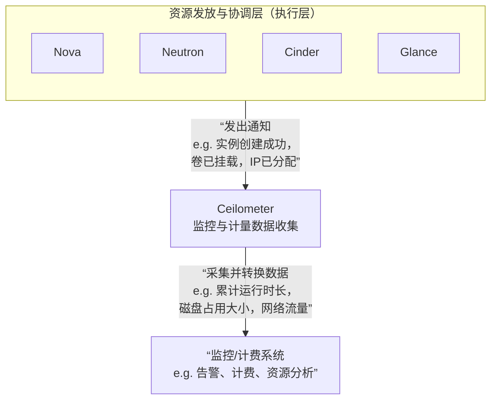

下面我们来详解这张图，看看Ceilometer是如何与各个组件互动的：

---

### **Ceilometer 与各个发放组件的直接关系**

Ceilometer 本身不参与发放过程的决策和执行，但它通过**监听** 各个组件发出的**事件通知** 和**轮询** 它们的**使用数据**来工作。

1.  **与 Nova（计算服务）的关系**
    *   **数据来源**：Ceilometer 监听 Nova 发出的事件，例如 `compute.instance.create.end`（实例创建成功）、`compute.instance.exists`（实例存在，用于轮询计费）。
    *   **收集的数据**：
        *   实例的运行时长（用于计算费用）
        *   vCPU和内存的分配数量
        *   实例的生命周期状态变化

2.  **与 Cinder（块存储服务）的关系**
    *   **数据来源**：监听 Cinder 的事件，如 `volume.create.end`（云硬盘创建成功）、`volume.attach.end`（云硬盘挂载成功）。
    *   **收集的数据**：
        *   云硬盘的容量（GB）
        *   云硬盘的快照容量
        *   云硬盘的使用时长

3.  **与 Neutron（网络服务）的关系**
    *   **数据来源**：监听 Neutron 的事件，并可能直接调用 Neutron API 查询数据。
    *   **收集的数据**：
        *   浮动IP地址的占用数量和时长
        *   网络的流入/流出流量
        *   负载均衡器的数量和时长

4.  **与 Glance（镜像服务）的关系**
    *   **数据来源**：监听 Glance 的事件，如 `image.update`（镜像更新）。
    *   **收集的数据**：
        *   镜像的上传次数
        *   镜像的下载流量
        *   镜像的存储容量

5.  **与 Keystone（身份服务）的关系**
    *   **数据来源**：Ceilometer 收集的所有数据都会通过 Keystone 进行认证，并且数据会与**租户/项目** 信息进行绑定。
    *   **核心作用**：确保收集到的计量数据能够准确地归属到特定的用户或项目，这是实现**多租户计费**的基础。

---

### **总结：角色定位**

*   **Nova, Cinder, Neutron, Glance 等**：是云平台的 **“演员”和“工人”**，负责执行具体的创建、删除、配置等任务。
*   **Ceilometer**：是云平台的 **“会计”和“统计员”**。
    *   它坐在一旁，记录每个“工人”干了什么活（事件）。
    *   它清点了多少资源被消耗（采样）。
    *   它最终生成一份详细的“工单”和“资源消耗报表”（计量数据），用于**计费、资源使用分析、性能监控和自动伸缩**。

因此，没有Ceilometer，云平台依然可以发放资源，但将无法实现**基于使用的计费（Usage-Based Billing）**、无法进行**精确的成本分摊**、也难以实现基于实际负载的**自动化运维**。它让云平台从单纯的“资源发放器”变成了一个可运营、可管理的商业系统。

# 337（存疑）（其实我感觉C选项也是错误的
## 答案解析）
A. 错误：OBS虽然是扁平化的存储结构（没有传统文件系统的层级目录树），但并非没有存储空间限制。每个桶、每个账户都有默认的配额和容量上限，虽然这个上限通常非常大，但理论上是存在的。

B. 正确：数据（对象）必须存储在桶（Bucket）中，所以必须先创建桶。

C. 错误：OBS中可以通过在对象键（Key）中包含“/”来模拟文件夹，方便管理，但其本质只是一个命名约定，与文件系统的文件夹（真实的目录节点）不同。

D. 正确：访问OBS前需要正确配置DNS或Hosts，以便将OBS的端点域名解析到正确的服务地址
## OBS怎么模拟层级文件夹的？
好的，这是一个非常实际的问题。OBS（对象存储服务）通过一种 **“模拟”或“展示”** 的方式让用户感觉自己在使用文件夹，但其底层实现与传统文件系统有本质区别。

我们来彻底讲清楚它的原理和操作。

---

### 1. 核心原理：扁平化结构与“前缀”模拟

**传统文件系统（如NTFS, ext4）**：
- 是真正的**树状层级结构**。
- 目录（文件夹）是一个特殊的文件，记录了其包含的文件和子目录的元数据。
- 路径 `/home/user/document/file.txt` 表示一个严格的层级关系。

**OBS对象存储**：
- 本质是一个**扁平化的键值对存储**。您可以把它想象成一个巨大的“表格”。
- 这个表格只有两列：**对象键** 和 **数据体**。
- **对象键** 就是一个字符串，用于唯一标识一个对象。

**OBS的“文件夹”就是通过对象键的“命名前缀”来模拟的。**

---

### 2. 模拟机制详解

假设您想存储以下文件：
- 一个个人简历 `resume.pdf`
- 一些假期照片，比如 `holiday/beach.jpg` 和 `holiday/mountain.png`
- 工作文档，比如 `work/projects/projectA.docx`

在OBS中，它们会被存储为：

| 对象键 | 说明 |
| :--- | :--- |
| `resume.pdf` | 根目录下的文件 |
| `holiday/beach.jpg` | 键中包含 `/` |
| `holiday/mountain.png` | 键中包含 `/` |
| `work/projects/projectA.docx` | 键中包含多层 `/` |

**OBS的控制台（网页界面）或某些客户端工具会怎么做？**

1.  **扫描所有对象键**。
2.  **根据分隔符 `/` 来解析这些键**。
3.  **将共同的前缀“展示”为文件夹**。

所以，当您在OBS控制台中看到的结构是：
```
桶/
├── resume.pdf
├── holiday/
│   ├── beach.jpg
│   └── mountain.png
└── work/
    └── projects/
        └── projectA.docx
```

**但实际上，底层根本不存在名为 `holiday`、`work` 或 `projects` 的对象或文件夹。** 存在的只是四个拥有不同键的对象。

---

### 3. 如何创建和操作“模拟文件夹”

#### **方法一：通过OBS控制台（最直观）**

1.  **进入您的OBS桶**。
2.  **点击“创建文件夹”按钮**。
3.  输入文件夹名称，例如 `documents`。

**背后发生了什么？**
当您通过控制台创建一个空文件夹时，OBS实际上会**创建一个特殊的对象**，其对象键为 `documents/`。
- 请注意，这个键是**以分隔符结尾**的。
- 这个对象的内容是**空的**（大小为0字节）。
- 它的存在只是为了在列表中**显示为一个文件夹**，以便您后续可以将文件拖拽进去。

#### **方法二：通过API/SDK编程上传对象**

当您使用代码上传一个对象，并将其键设置为包含 `/` 时，OBS会自动在界面上“模拟”出文件夹结构。

**例如，使用Python SDK：**

```python
# 上传一个文件，并将其放置在“模拟文件夹”中
obs_client.put_file(
    'your-bucket-name',
    'work/projects/project_plan.docx',  # 这就是对象键，直接定义了“路径”
    'local_file_path/project_plan.docx'
)
```
上传成功后，在OBS控制台中，您会看到 `work` 文件夹下有 `projects` 子文件夹，里面包含了 `project_plan.docx` 文件。您**不需要**事先创建 `work` 和 `projects` 文件夹。

---

### 4. 重要注意事项

1.  **删除“文件夹”**：
    - 在OBS控制台中删除一个文件夹，实际上是发起了一个**批量删除请求**，删除了所有以该文件夹名称为前缀的对象键。
    - 例如，删除 `holiday/` 文件夹，就是删除所有对象键以 `holiday/` 开头的对象。

2.  **性能与成本**：
    - 列出文件列表时，如果您有海量对象，使用前缀（相当于进入深层文件夹）进行查询会**比在根目录下列出所有对象高效得多**。
    - 存储一个大小为0的空“文件夹”对象，虽然不占数据存储空间，但会占用对象数量配额（每个桶最多支持3000万个对象）。

3.  **与文件系统的本质区别**：
    - **重命名文件夹**：在文件系统中是瞬间完成的元数据操作。在OBS中，您需要**复制所有带旧前缀的对象到新前缀下，然后删除旧对象**，这是一个昂贵且耗时的操作。
    - **原子性操作**：OBS的操作（如上传、删除）是针对单个对象的，不具备文件系统跨多个文件/目录的事务原子性。

### 总结

OBS通过 **“对象键名称前缀 + 分隔符`/`”** 的方式，在用户界面层巧妙地**模拟**了文件夹的层级结构，使得用户可以使用熟悉的文件管理方式来组织数据，但其底层仍然是高效的、扁平的键值对存储。这种设计在保持简单性和可扩展性的同时，提供了良好的用户体验。
# 338（存疑）

# 339
## 解析：
这道题考察对混合云典型部署模式的理解。核心原则是：安全要求高的核心业务和敏感数据放在私有云（华为云Stack），需要弹性扩展的非核心业务放在公有云（华为云）。
A. 错误：描述说“前端业务部署在Stack，后端核心业务部署在华为云”。这与安全最佳实践相悖。通常，前端无状态业务可以放公有云以利用弹性，而包含敏感数据的后端核心业务必须放在可控的私有云中。
B. 正确：描述了典型的“云爆发”场景，私有云资源不足时扩展到公有云。
C. 正确：描述了“业务分层部署”场景，利用公有云的全球节点满足海外用户就近访问。
D. 正确：描述了典型的分层部署，前端在公有云，关键后端和数据在线下（私有云），符合安全规范。
# 知识点总结：
混合云 结合了公有云的弹性、广覆盖和私有云的安全、可控。
部署原则：
公有云：面向互联网的前端、需要快速弹性扩展的业务、容灾备份。
私有云：核心数据库、关键业务处理、敏感数据。
# 340（存疑）
## 解析：
A. 错误：描述说“资源编排模板分为可视化模板和HOT模板两种...两者功能一致”。这是错误的。可视化模板（MCP） 和 HOT模板 是两种不同的资源编排引擎。MCP功能更强大，支持图形化拖拽和复杂逻辑；HOT是OpenStack标准的文本模板。两者底层实现和功能支持并不完全一致。
B. 正确：用户可以在自己创建的模板中引用系统预置的模板，实现模板的复用和嵌套。
C. 错误：描述说“资源编排模板具有图形化界面，API编排模板通过配置文件实现”。这个描述混淆了。资源编排模板可以有图形化界面（MCP），但也支持文本格式（HOT）。API编排模板本身是通过图形化流程设计器来编排的，并非只能通过配置文件。因此C选项的描述不准确，但题目问的是“错误的是哪一项”，且正确答案给的是A，说明命题人认为A的错误更根本。
D. 正确：服务模板的来源可以是系统预置、用户自定义或从社区导入。
## 知识点总结：

服务模板 用于实现应用的自动化部署和资源编排。

资源编排模板：

HOT模板：基于YAML的文本模板，OpenStack标准。

MCP模板：华为增强的可视化图形模板，功能更丰富。

API编排模板：用于编排无服务器函数、API调用等操作流程。


# 341
A：正确。OBS 的并行文件系统（PFS）确实针对高性能计算场景设计，提供低延迟和高吞吐。
B：错误。OBS 中桶（Bucket）的名字必须在整个命名空间（通常是区域级别）内全局唯一，不能创建同名桶。
C：正确。OBS 支持 REST API 通过 HTTPS 进行安全访问。
D：正确。==OBS 提供多种权限控制机制：桶 ACL、桶策略、对象 ACL、对象策略等，可以精细控制其他用户的访问权限。==

# 345
HIAI Foundation 核心功能是模型转换、迁移和在端侧 NPU 上的高效执行。

# 348
A: k-折交叉验证是常用的交叉验证方法 （正确，这是事实）
B: 交叉验证首先用训练集对分类器进行训练再利用验证集来测试训练得到的模型以此来做为评价分类器的性能指标 （正确，描述了基本流程）
C: 交叉验证是用来验证分类器的性能&mdash；种统计分析方法 （正确，这是它的目的）
D: k-折交叉验证方法中的k不是超参数是由模型训练得来的 （错误）

# 351
---

### **核心概念：图级即时编译**

**图级即时编译** 指的是深度学习编译器在**计算图**这个层级上，对模型进行整体分析和优化，然后再生成高效的硬件执行代码。这些优化通常不改变模型的数学结果，但能大幅提升执行效率。

---
### **选项分析**

#### **A. 算子融合**
- **这是什么**：将多个细粒度的小算子（如Convolution、BiasAdd、Activation）合并成一个大的复合算子。
- **为什么是面向硬件的优化**：
    - **减少内核启动开销**：每个算子在GPU/CPU上启动都需要开销，融合后只需启动一次。
    - **提高数据局部性**：中间结果直接在芯片的寄存器或高速缓存中传递，避免了写回和读取慢速内存的操作。
- **结论**：这是一项非常经典的、面向硬件性能的图级优化。**属于**。

#### **B. Layout优化**
- **这是什么**：调整Tensor数据在内存中的排列格式（例如，NCHW格式与NHWC格式之间的选择或转换）。
- **为什么是面向硬件的优化**：
    - 不同的硬件（如AI芯片的计算单元）和不同的算子（如卷积）对数据布局有不同的偏好。使用硬件友好的Layout可以充分发挥计算单元的效能，避免频繁的格式转换。
- **结论**：这直接是为了匹配硬件特性而进行的优化。**属于**。

#### **C. 冗余消除**
- **这是什么**：消除计算图中重复的、无用的计算。例如，两个相同的计算分支合并为一个；删除不影响最终结果的恒等变换（如 `x * 1`）。
- **为什么是面向硬件的优化**：
    - 直接减少了不必要的计算量和内存访问，节省了宝贵的硬件计算资源和内存带宽。
- **结论**：通过简化计算图来提升硬件执行效率。**属于**。

#### **D. 自动并行**
- **这是什么**：将模型或计算图拆分，并分配到多个设备（如多GPU/多NPU）或者同一设备的多个计算核心上并行执行的技术。包括数据并行、模型并行、流水线并行等。
- **为什么它“不属于”**：
    - 自动并行主要是一种**分布式计算策略**，它关注的是**如何在多个计算单元间分配工作和协调通信**。
    - 虽然它的最终目的也是提升速度，但其优化层面是**系统级和调度级**的，而非面向**单个硬件单元内部特性**的图优化。
    - 相比之下，前三个选项（算子融合、Layout优化、冗余消除）都是在**单个计算设备内部**，为了最大化该设备的执行效率而对计算图本身进行的改造。
- **结论**：自动并行是**跨设备**的优化，而不是面向**单个硬件**的图级优化。因此，它最可能被划分为“不属于”题目所限定的范畴。

---

### **总结**

题目问的是“**面向硬件所进行的优化操作**”，这里更强调的是针对**单个硬件计算单元特性**的底层优化。而 **自动并行 (D)** 的核心是**分布式和并行计算**，属于更高层次的系统资源调度范畴，因此它被排除在外。

所以，正确答案是 **D**。您选择的 B（Layout优化）恰恰是一项非常重要的面向硬件的优化操作。


# 356
## 答案解析
A. 聚类
是无监督学习。
它的任务是将数据自动分组，数据本身没有“类别”标签，完全靠算法发现相似性。
B. Xgboost
不是无监督学习，是有监督学习。
Xgboost 是梯度提升决策树算法的一个高效实现，它需要带标签的数据来训练模型，主要用于解决分类和回归问题。
C. 关联规则
是无监督学习。
它的经典应用是“购物篮分析”，从交易数据中发现物品之间的关联规律（如“买啤酒的人常买尿布”），数据本身没有标签。
D. GMM
是无监督学习。
GMM 是高斯混合模型，常用于聚类和密度估计。它通过多个高斯分布的叠加来描述数据分布，不需要数据标签。

## 无监督学习和监督学习
==无监督学习==：
特点：数据没有标签（即没有预先给出的“正确答案”）。
目标：发现数据内在的结构、模式或分布。
典型任务：聚类、降维、关联规则学习、密度估计等。
==监督学习==：
特点：数据有标签。
目标：学习一个从输入到输出的映射函数，用于预测。
典型任务：分类、回归。

## 密度估计
### 一句话理解
**密度估计就是：找出数据在空间中的“热门地段”和“冷门地段”，并画出一张“人口密度分布图”。**

---

### 一个生动的比喻：城市规划

想象你是一个城市规划师，想了解城市里人口的分布情况。

1.  **你手头有数据**：每个居民的住址（这就是你的“数据点”）。
2.  **你的目标**：绘制一张城市人口密度地图，上面标出哪里是人口稠密的市中心，哪里是人口稀少的郊区。

这个过程就是**密度估计**。

- **高密度区域**：意味着这个地方的“数据点”（居民）非常多，很“热门”。在机器学习中，这意味着一个新数据点如果落在这里，是很“正常”或“很常见”的。
- **低密度区域**：意味着这个地方的“数据点”很少，很“冷门”。一个新数据点如果落在这里，可能很“异常”或“不寻常”。

---

### 与题目中 GMM 的联系

**GMM（高斯混合模型）** 就是一种非常强大的密度估计工具。

继续用城市规划的比喻：

- **一个高斯分布**：就像你发现城市里有一个明确的“市中心”，大部分居民都围绕这个中心居住。它在地图上表现为一个“小山丘”。
- **高斯混合模型**：但你发现城市不止一个中心！可能有一个“金融区”、一个“大学城”、一个“工业区”。每个区都有自己的居民聚集中心。

GMM 做的就是这件事：
它用**多个高斯分布（多个“小山丘”）** 叠加在一起，来精确地描述整个城市复杂的人口分布情况。它不仅能告诉你密度高的地方在哪，还能告诉你有几个主要的“人群聚集区”（这其实就是**聚类**），以及每个聚集区的范围和形状。

---

### 为什么密度估计是无监督学习？

回顾一下无监督学习的定义：**数据没有标签**。

在我们的比喻中：
- 你只有居民的**地址数据**（原始数据点）。
- 没有人事先告诉你“这个是金融区居民”、“那个是大学城居民”（没有标签）。
- 模型（GMM）需要**自己从数据中**发现并描绘出这些聚集模式。

这正是无监督学习的核心任务——**从无标签的数据中发现内在结构**。

---

### 密度估计的实际应用

1.  **异常检测**：这是最直接的应用。如果一个数据点落在了密度极低的“偏远郊区”，它就很可能是异常点或故障点。比如，检测网络攻击（正常流量都在“热门地段”，攻击流量在“冷门地段”）。
2.  **数据生成**：一旦你学会了数据的密度分布图（比如学会了人脸的密度分布），你就可以从这个分布中**采样**，生成新的、类似的数据（这就是生成式AI，如GANs、扩散模型的核心思想之一）。
3.  **聚类**：正如GMM所做的，找到数据中不同的“聚集区”，自然就把数据分成了不同的簇。

### 总结

**密度估计**就是一个**“摸清数据家底”** 的过程。它不关心数据的具体标签，只关心数据点们喜欢“扎堆”在什么地方。通过画出这张“密度地图”，我们就能更好地理解数据、发现异常、甚至创造新数据。
所以，题目中的 **GMM** 通过进行密度估计来完成聚类任务，它是一个非常经典的无监督学习算法。


# 360（存疑）
感觉应该D对，A错。
分析如下：
对于 1 个 epoch，小批量梯度下降的参数更新次数少，且每次更新时 GPU 并行效率高。
相比之下随机梯度下降，更新次数多，且每次更新 GPU 利用率低。
因此，在 GPU 上，小批量 GD 完成 1 个 epoch 的速度通常比随机 GD 快。
所以 D 选项的描述是正确的。
全局梯度下降比较稳定，这种稳定性能帮助模型收敛到全局极值。
→ 前半句对，后半句有问题，因为稳定不代表一定收敛到全局极值，可能只是局部极值。所以 A 可能错误。

# 365
好的，我们来详细解释这两个深度学习中至关重要的损失函数。

---

### 什么是损失函数？

首先，简单理解**损失函数**：它是用来**衡量模型预测值与真实值之间差距**的一个函数。损失值越大，说明模型预测得越不准。训练模型的目标就是通过不断调整参数，让这个损失值尽可能变小。

---

### 1. 均方误差

**均方误差**（Mean Squared Error, **MSE**）是最常见、最直观的损失函数之一。

#### (1) 定义与计算
它计算的是**预测值与真实值之间差值的平方的平均值**。
**公式：** `MSE = (1/N) * Σ(真实值 - 预测值)²`
其中 N 是样本数量。

#### (2) 直观理解
你可以把它理解为一种 **“放大镜”**：
- **平方** 的作用是：
    1.  **放大大的误差**：如果一个预测错得很离谱，它的平方会变得非常大，从而在总损失中占据更大比重，迫使模型优先去修正这些大的错误。
    2.  **消除正负号**：无论预测值比真实值大还是小，差值平方后都是正数，确保损失是累加的。

#### (3) 主要应用场景：**回归问题**
- **回归问题** 的目标是预测一个**连续的数值**。
- 例如：预测房价、预测气温、预测销量等。
- 在这些问题中，MSE 非常有效，因为它直接惩罚了预测值与真实值之间的“距离”。

---

### 2. 交叉熵误差

**交叉熵**（Cross Entropy）起源于信息论，用于衡量两个概率分布之间的差异。

#### (1) 定义与计算
在深度学习中，它衡量的是**模型预测的概率分布**与**真实的概率分布**之间的差异。
在二分类问题中，其公式简化为：
`Cross Entropy = - [真实值 * log(预测值) + (1 - 真实值) * log(1 - 预测值)]`

对于多分类问题，通常是：
`Cross Entropy = - Σ (真实标签的one-hot编码 * log(预测概率))`

#### (2) 直观理解
交叉熵衡量的是“为了用预测分布来表示真实分布，所额外需要的努力（信息量）”。预测得越准，交叉熵越小。

**一个生动的比喻：**
- 真实分布是 **“标准答案”**。
- 模型预测分布是 **“你的答案”**。
- 交叉熵就是 **“老师批改你卷子时，发现你的答案离标准答案有多远时所感受到的困惑程度”**。你的答案越离谱，老师就越困惑，交叉熵就越大。

#### (3) 主要应用场景：**分类问题**
- **分类问题** 的目标是预测一个**离散的类别标签**。
- 例如：图像分类（猫/狗）、垃圾邮件识别（是/否）。
- 在分类问题中，模型的最后一层通常是 Softmax（多分类）或 Sigmoid（二分类），将输出转换为**概率**。交叉熵损失函数正是与这些概率输出**完美匹配**的“黄金搭档”。

---

### 两者对比与题目解析

| 特性 | 均方误差 | 交叉熵误差 |
| :--- | :--- | :--- |
| **核心思想** | 衡量**数值**之间的差距 | 衡量**概率分布**之间的差距 |
| **主要应用** | **回归问题** | **分类问题** |
| **与输出层搭配** | 线性输出层 | Softmax / Sigmoid |
| **梯度特性** | 在分类问题中，当预测完全错误时，梯度可能很小，导致学习慢（饱和问题） | 在分类问题中，梯度与误差成正比，预测错得越离谱，梯度越大，学习越快，能有效避免饱和 |

现在我们来分析题目：

**题目：** 深度学习常用的损失函数主要有均方误差和交叉熵误差，针对两者的使用场景以下说法正确的是：

- A 均方误差更多用于分类问题 **（错误，它主要用于回归）**
- B 交叉熵误差更多用于回归问题 **（错误，它主要用于分类）**
- C 两者均可用于回归问题 **（错误，交叉熵用于回归非常罕见且不合适）**
- D 两者均可用于分类问题 **（正确）**

**为什么 D 是正确的？**

- **均方误差理论上可以用于分类**：比如在一个二分类问题中，你可以用 1 和 0 作为标签，然后用 MSE 来衡量预测值与 1/0 的差距。在早期神经网络和一些简单场景中，确实有人这么用。
- **交叉熵就是为分类设计的**：这是它的主战场。

所以，从严格的技术可能性上讲，“两者均可用于分类问题”这个说法是成立的，尽管在实践中**交叉熵是分类问题的绝对首选**，而 MSE 主要用于回归。

题目的考点在于考察你对这两个损失函数**主要应用场景**的理解，以及理论上是否可行。它提醒我们，虽然 MSE 能用于分类，但由于梯度等问题，其效果远不如交叉熵。

个人理解：交叉熵和MSE都能应用到分类任务上，但交叉熵考虑细腻度更高的信息。

# 371
## 对本题进行一些知识扩展

通常，我们认为人工智能的发展会经历三个从低级到高级的阶段，如下图所示：

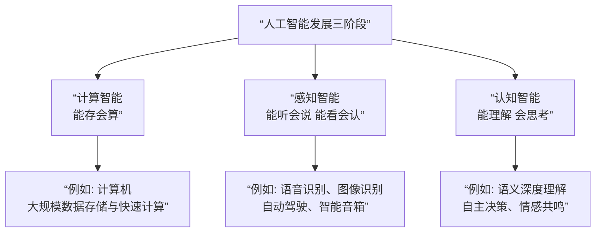

---

### 1. 计算智能（Computational Intelligence）
- **核心特征**：**能存会算**。机器拥有快速计算、海量存储和循规蹈矩的逻辑处理能力。
- **表现**：
  - 计算机在数值计算、数据存储和检索方面远超人类。
  - 能基于既定规则执行复杂的逻辑操作。
- **例子**：
  - 早期的计算机、计算器。
  - 数据库系统。
  - 击败国际象棋世界冠军的“深蓝”（主要依靠强大的计算能力穷举可能性）。
- **对应选项**：题目中的 **B. 机器开始像人类一样会计算，传递信息**。

### 2. 感知智能（Perceptual Intelligence）
- **核心特征**：**能听会说，能看会认**。机器能够模拟人类的视觉、听觉、触觉等感知能力，从物理世界中识别和提取信息。
- **表现**：
  - **“看懂”**：通过计算机视觉技术识别图像和视频中的物体、人脸、场景等。
  - **“听懂”**：通过语音识别技术理解人类的语言，并将其转化为文字。
  - **“做出判断，采取简单行动”**：基于感知到的信息，进行简单的分析和决策，并驱动执行器行动。
- **例子**：
  - **语音助手**（如Siri、小爱同学）：能听懂你的指令，并执行播放音乐、设定闹钟等简单行动。
  - **自动驾驶**：通过摄像头和雷达“看”懂路况，判断行人、车辆，并控制方向盘和刹车。
  - **人脸识别门禁**：识别出你的人脸后，判断“是管理员”并执行“开门”的行动。
- **对应选项**：题目中的 **C. 机器开始看懂和听懂，做出判断，采取一些简单行动**。**（正确答案）**

### 3. 认知智能（Cognitive Intelligence）
- **核心特征**：**能理解，会思考**。这是人工智能的最高阶段，要求机器能够理解信息的深层含义，进行逻辑推理、知识迁移、自我学习和做出战略决策。
- **表现**：
  - **真正理解语言**：理解成语、讽刺、隐喻等，把握上下文和语境。
  - **因果推理与规划**：不仅知道“是什么”，还能分析“为什么”，并能规划出实现目标的步骤。
  - **自主意识与情感交互**：拥有常识，甚至具备情感计算能力，能与人类进行深度的情感交流。
- **例子**：
  - **高级别的对话机器人**：能够进行有逻辑、有深度的多轮对话，理解用户的真实意图和情感。
  - **自主决策的AI医生**：不仅能看医学影像（感知），还能综合病人病史、最新研究，推理出病因并提供个性化的治疗方案。
  - **具备常识的AI**：知道“冰是滑的”，所以人在冰上走路可能会摔倒。
- **对应选项**：题目中的 **A. 机器开始像人类一样能理解、思考与决策**。

---

### 总结与现状

- **当前阶段**：我们目前正处于 **“感知智能”走向成熟，并开始向“认知智能”深度探索** 的时期。
  - **感知智能** 技术已经广泛应用于我们的日常生活（刷脸支付、语音转文字、推荐系统等）。
  - **认知智能** 是当前研究的热点和难点，虽然大型语言模型（如GPT-4）在浅层认知上表现出色，但在真正的深度理解、因果推理和常识判断方面，与人类仍有巨大差距。

所以，题目准确地将 **“看懂和听懂，做出判断，采取一些简单行动”** 界定为 **感知智能** 的典型表现。
# 373
在机器学习中，梯度下降算法用于优化模型参数以最小化损失函数。批量梯度下降（BatchGradientDescent）在每次更新参数时使用所有样本，小批量梯度下降（Mini-BatchGradientDescent）在每次更新时使用一部分样本，而随机梯度下降（StochasticGradientDescent）则每次仅使用一个样本。
# 374
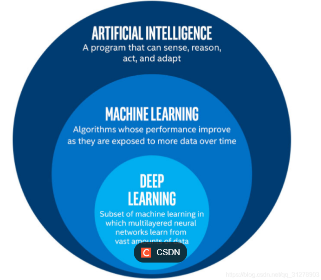

# 375
多项式回归中，即使模型的公式中存在平方项或其他高次项，该模型仍然被认为是线性的。这里的“线性”指的是模型参数是线性的，即模型的输出是输入变量的加权和（尽管这些输入变量可能被转换，如平方）。因此，即使模型中包含平方项，它仍然是线性回归模型的一种。
# 376
一个例子来帮助理解：
## 376.1 优化困难与梯度问题
模型变得极其复杂时，其损失函数的地形会变得非常崎岖和复杂。

梯度消失/梯度爆炸：在非常深的神经网络中，这是常见问题。梯度在反向传播过程中会变得极小（消失）或极大（爆炸），导致模型参数无法得到有效的更新，训练会早停，训练误差卡在一个较高的水平无法继续下降。

陷入局部最优或鞍点：高度复杂的模型拥有海量的局部最优点和鞍点。优化算法（如SGD）很容易陷入一个不好的局部最优解中，无法找到那个能使训练误差更小的解。虽然深度学习模型通常不担心局部最优点，但鞍点问题依然存在。

# 377
在AI应用中，尤其是在==处理图像数据时，经常需要将图像数据编码为base64格式==。这是因为base64编码可以将二进制数据转换为ASCII字符串，便于在网络中传输和处理。护照识别服务作为一种AI应用，同样需要将图像数据编码为base64格式以便进行后续的图像处理和识别工作。因此，说护照识别服务的图像数据不需要用base64编码是错误的。

# 380
在TensorFlow框架中，`tf.keras.datasets`是一个模块，它提供了多个常用的内置数据集，例如MNIST、CIFAR10等，这些数据集常用于机器学习和深度学习的训练和测试。

# 381
## 答案解析
tensorFlow2.0中的keras.metrics模块提供了多种内置指标，用于评估模型的性能。Accuracy（准确率）和Recall（召回率）都是常见的分类评估指标，而Mean（平均值）也是一种常用的统计指标，可用于回归问题的评估。相比之下，Sum（求和）并不是keras.metrics中的内置指标方法，它通常用于基本的数学运算，而不是作为模型性能的评估指标。

# 382


# 384
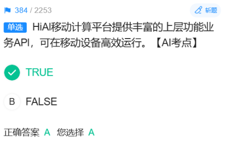

# 385
## 解析：
在华为云Stack中，一级VDC管理员账号具有基本的权限和功能，包括对共享镜像的移除、私有镜像的创建和共享等操作。但是，由于==公共镜像的创建需要更高的权限==，因此一级VDC管理员无法执行此操作。

## 为什么公共镜像的创建需要更高的权限？VDC管理员为什么创建不了公共镜像

### **为什么一级VDC管理员无法创建公共镜像？**

这需要从镜像的权限模型和不同管理员的职责来理解：

1.  **公共镜像的全局性**：
    *   **公共镜像** 是由云平台**官方**提供的、所有用户（包括各级VDC管理员和普通用户）都可以看到并使用的标准镜像（如纯净版的CentOS、Windows Server等）。
    *   它属于**全局级资源**，影响范围是整个云平台。

2.  **权限隔离与职责分离**：
    *   **一级VDC管理员** 的权限范围通常被限定在**他所管理的一级VDC及其下属的二级VDC和项目**之内。他的核心职责是向下分配资源（计算、存储、网络配额），管理下属的组织和用户，而不是定义平台的全局基础设置。
    *   **创建公共镜像** 这个操作，相当于在为整个云平台“添砖加瓦”，这超出了单个VDC管理员的管辖范围。这个权限通常属于更高级别的**系统管理员**或**运营管理员**。

3.  **风险与控制**：
    *   公共镜像如果存在问题（如带有病毒、配置错误），会影响到平台上所有可能的用户。因此，创建和发布公共镜像的权力必须被严格控制和审计，不能下放给VDC管理员。

---

### **为什么其他选项的操作一级VDC管理员可以执行？**

让我们看一下其他选项，这些都在一级VDC管理员的权限范围内：

*   **A. 移除共享镜像**：
    *   “共享镜像”是其他VDC或用户**共享给你（你所在的一级VDC）** 的镜像。
    *   一级VDC管理员有权管理流入自己管辖范围的共享资源，包括**移除**（即取消接受）别人共享过来的镜像。这并不删除原镜像，只是在自己的视图里不再显示。

*   **C. 创建私有镜像**：
    *   “私有镜像”是用户在自己项目中创建的镜像。一级VDC管理员在自己的权限范围内（比如在自己的默认项目中）完全有权基于已有的云服务器创建私有镜像，供自己或下属组织使用。

*   **D. 共享私有镜像**：
    *   一级VDC管理员可以将自己创建的**私有镜像** **共享**给自己管辖下的**二级VDC**或其他项目。这是一种向下的资源分配行为，正是VDC管理员的核心职责之一。

---

### **总结与归纳**

为了更直观地理解这几种镜像类型和管理员权限的关系，可以参考下面的表格：

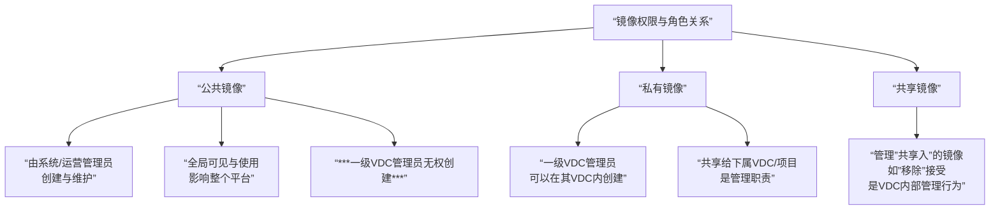

所以，这道题考察的是对云平台**角色权限模型**和**资源全局性**的理解。**公共镜像**由于其全局性和基础性，其创建权限被保留给了级别更高的管理员。

# 386
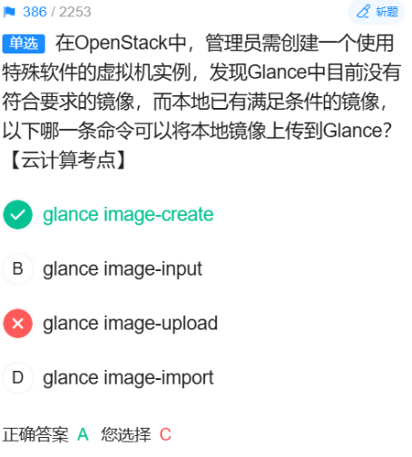

# 387 
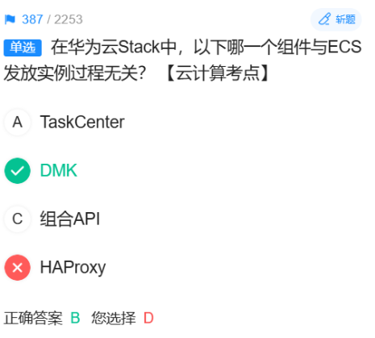
## 答案解析
TaskCenter：负责任务调度和管理，实例发放涉及任务执行，有关。
DMK（Deployment and Maintenance Kit）：用于云平台的部署和维护，与日常 ECS 实例发放流程无直接关系。
组合API：发放实例时会调用组合 API 来编排资源，有关。
HAProxy：负载均衡，与实例发放无直接关系，但这里可能 DMK 更无关，因为题目是华为云 Stack 题库，DMK 是部署运维工具，不参与业务实例创建流程。
但题库答案给的是 B（DMK），说明==他们认为 DMK 比 HAProxy 更无关==。可能 HAProxy 在 API 网关或服务访问链路上可能间接有关，而 DMK 完全无关。


## 1. “发放实例”是什么意思？

**ECS** 是 Elastic Cloud Server（弹性云服务器）的缩写，你可以简单理解它就是一台在云端创建的**虚拟电脑**（虚拟机），拥有自己的 vCPU（虚拟处理器）、内存、操作系统和硬盘。

**发放实例** 指的是创建这台虚拟机的**整个过程**。这个词比单纯的“创建”或“启动”含义更广，它包括了从用户发起请求到最终得到一个可用虚拟机的完整工作流。

这个过程可以类比为在线购买一台定制化的电脑：

1.  **下单（用户请求）**：你在电商网站（云平台）选择你想要的电脑配置（CPU、内存、系统盘类型和大小、镜像【操作系统】、网络设置等）。
2.  **处理订单（API 接收与编排）**：电商系统收到你的订单，开始协调各个部门为你备货。
3.  **准备零件（资源调度）**：系统需要找到一台有足够空闲 CPU 和内存的物理服务器（宿主机），为你分配IP地址，从镜像仓库拉取操作系统文件，为你创建虚拟硬盘等。
4.  **组装与质检（创建与启动）**：在选定的物理服务器上，利用虚拟化技术（如 KVM）将分配的资源“组装”成一台虚拟机，然后启动它，并进行基础的健康检查。
5.  **交付（状态更新）**：系统确认虚拟机已成功启动并运行正常，然后在管理界面上将这台虚拟机的状态从“创建中”更新为“运行中”，并告诉你登录信息。至此，“发放”完成。

所以，**“ECS 发放实例”就是指云平台按用户需求，自动调度和组合各项资源（计算、存储、网络），最终交付一个可用的云服务器的端到端过程。**

---

## 2. 为什么构建实例需要多个组件协同工作？
答案是：为了实现**高内聚、低耦合、可扩展、高可靠**的架构。没有一个万能组件能包办所有事情，将复杂任务拆解并由专门组件负责，是工程学的普遍原则。

想象一下，如果发放实例由一个“超级大单体程序”来完成，它会面临所有问题：

*   **过于复杂**：代码庞大，难以维护和更新。
*   **单点故障**：这个程序一旦崩溃，整个云平台创建虚拟机的功能就全部瘫痪。
*   **无法扩展**：如果创建虚拟机的请求非常多，这个单体程序可能成为瓶颈，无法通过增加节点来分担压力。
*   **牵一发而动全身**：修改网络部分的功能，可能会影响到存储部分，风险极高。

因此，现代云平台（如华为云Stack/OpenStack）都采用**微服务架构**，将发放实例这个宏大的任务拆解成多个子任务，并由不同的**专业组件**各司其职。

---

## 3. 发放实例过程中的关键组件及其角色（结合之前的题目）
让我们看看在像华为云Stack（基于OpenStack）这样的环境中，发放实例时有哪些主要组件参与：

1.  **Dashboard / CLI / API**：
    *   **角色**：**用户交互入口**。你通过在网页上点击按钮或运行命令，最终都会转化为一个标准的API调用请求。

2.  **Nova**：**计算服务**，是发放实例的**总指挥**。
    *   **接收请求**：它通过 API 接收到“创建一台XX配置的云服务器”的指令。
    *   **调度决策**：它的 **Scheduler** 子组件会从资源池中筛选出一台最合适的物理服务器来承载这个新实例。
    *   **协调工作**：**Nova 本身不直接处理网络和存储**，它会向**Neutron**和**Cinder**等服务下达指令，让它们配合完成工作。

3.  **Neutron**：**网络服务**。
    *   **角色**：负责一切网络相关事务。Nova 会通知 Neutron：“请为这个新实例分配一个IP，并连接到指定的虚拟网络（VPC）上，配置好安全组规则。”
    *   **题目关联**：你之前做对的题中，Router、Security Groups 这些高级网络功能就是由 Neutron 的 **Service Plugin** 实现的。

4.  **Cinder**：**块存储服务**。
    *   **角色**：负责提供和管理硬盘。Nova 会通知 Cinder：“请根据要求，创建一块虚拟硬盘，并挂载到新实例上。”

5.  **Glance**：**镜像服务**。
    *   **角色**：负责存储和管理操作系统模板（镜像）。Nova 会从 Glance 那里获取用户选择的系统镜像（如 CentOS, Windows），并以此为基础来创建实例的系统盘。

6.  **Keystone**：**身份认证服务**。
    *   **角色**：**云平台的“安全守门人”**。在整个发放过程中，上述所有组件之间的每次互相调用，都需要经过 Keystone 来验证身份和权限，确保“是合法的请求在访问合法的资源”。

7.  **TaskCenter / 组合API**：
    *   **角色**：**流程编排器**。对于复杂的发放流程（例如一次性创建多台关联的实例），这些组件负责将多个步骤串联起来，确保它们按正确顺序执行，并处理错误和回滚。

## 总结

*   **发放实例**：是云平台**自动化创建虚拟机**的端到端过程。
*   **为什么需要组件**：因为这是一个极其复杂的任务，涉及计算、存储、网络、认证等多个专业领域。通过**组件化（微服务）设计**，可以让每个组件专注于自己的核心功能，使得整个系统更加**健壮、灵活、易于维护和扩展**。各个组件通过 API 相互协作，在“总指挥”Nova 的协调下，共同完成发放实例的宏大工程。


# 388(实记)
解析：
Core Plugin：实现核心网络功能（网络、端口等）。
Service Plugin：实现扩展高级服务，如路由、防火墙、负载均衡、VPN 等。
题中 Router、Security Groups、FwaaS 都属于高级网络服务，由 Service Plugin 实现。

# 389
## 正确的优先级
bool < int < float

# 390
## 什么是华为云翻拍识别服务？
它的核心功能就是判断一张输入的图片是 “original”（原图） 还是 “recapture”（翻拍图）。

## 答案解析：
suggestion 为 true 表示检测到是翻拍（recapture），此时 category 应为 "recapture"。
suggestion 为 false 表示原图（original），此时 category 为 "original"。
所以 suggestion 为真 → recapture。

# 391（存疑）
## 解析：
A：正确。trace id 用于追踪请求，无论成功失败一般都会返回。
B：正确。saved_Path 就是保存路径。
C：描述错误？其实这里要看语音合成服务的 API 设计，通常调用失败时 result 字段不存在，这个描述是正确的。但为什么答案是 D 而不是 C？
可能因为 C 的说法在某些服务里失败时也可能返回 result（含错误信息），但题干明确是“语音合成”，合成成功才有 result（音频数据或路径），失败时无此字段，这符合常规设计，所以 C 不算错。
D：错误。一般没有 is saved 这个字段，可能是 is_saved 或 saved，但更重要的是，它并不表示“是否成功保存”，而是表示“是否已保存到指定路径”，这个字段在很多 API 里并不存在，或者它的含义被错误描述。

# 392
自己求导下喽！

# 393
机器学习算法通常被应用于处理大规模的数据和问题，这一点是正确的。然而，与传统基于规则的方法相比，机器学习算法并不是因为规则简单而应用广泛。相反，机器学习算法的优势在于它们能够从大量数据中自动学习复杂的模式和规律，这些模式和规律往往难以用简单的规则来描述。因此，说机器学习算法应对的问题规模大，但规则简单是不准确的。

# 394
## 什么是L1正则化？
**L1正则化** 是一种在机器学习模型中，为了防止过拟合而使用的技术。它通过向模型的**损失函数**中添加一个“惩罚项”来实现。

这个惩罚项是模型**权重系数绝对值的总和**（即L1范数）乘以一个正则化参数（通常记为 λ）。

---

### 具体到线性回归

1.  **普通线性回归的损失函数**（以均方误差为例）：
    *   目标是让模型的预测值尽可能接近真实值。
    *   损失函数 = Σ(预测值 - 真实值)²

2.  **加入L1正则化后的损失函数**：
    *   新的损失函数 = Σ(预测值 - 真实值)² + **λ * Σ|权重|**
    *   其中 **λ * Σ|权重|** 就是L1正则化项。

---

### L1正则化的核心作用与特点

1.  **防止过拟合**：
    *   惩罚项会“约束”模型的权重，防止它们变得过大，从而让模型不会过分依赖任何一个或几个特征，提升模型的泛化能力。

2.  **关键特性：自动特征选择**：
    *   这是L1正则化最独特和重要的性质。
    *   在优化过程中，由于绝对值项的存在，它会倾向于将那些对最终预测结果不重要的特征的**权重直接压缩到0**。
    *   **结果**：最终模型会完全忽略掉这些特征，只保留那些最重要的特征。这相当于在训练模型的同时，自动完成了特征选择。

---

## 什么是Lasso回归？

*   **Lasso回归** 的定义就是：**在线性回归的损失函数中加入了L1正则化项**。
*   “Lasso”这个词本身就是“**L**east **A**bsolute **S**hrinkage and **S**election **O**perator”的缩写，直译就是“**最小绝对收缩和选择算子**”，这个名字完美地概括了它的两个核心作用：“收缩权重”和“特征选择”。

**因此，题目中的陈述“线性回归的损失函数中加入L1正则化，此时该回归叫做Lasso回归”是完全正确的。**

> **补充知识**：与之相对的是 **L2正则化**，它惩罚的是权重的平方和。加入L2正则化的线性回归被称为 **Ridge回归（岭回归）**。它也能防止过拟合，但不会将权重压缩至0，而是让它们均匀地变小。

# 395
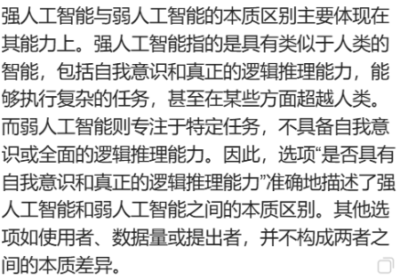

# 397
## K-means算法
### 核心思想

K-means 是一种非常经典且常用的**无监督学习**算法，用于将数据自动分成几个类别（即“聚类”）。

它的目标非常直观：**“物以类聚”**。它试图将数据集划分为 K 个簇，使得同一簇内的数据点彼此非常相似，而不同簇的数据点则尽可能不同。

### 工作原理（“猜-算-移”三部曲）

K-means 算法的执行过程非常清晰，可以概括为三个步骤，并不断重复直到稳定。

**第0步：初始化 - “猜”**
*   首先，由我们**人为指定**想要将数据分成几类，这个数量就是 **K**。
*   然后，算法随机在数据空间中选择 K 个点作为初始的**聚类中心**。

**第一步：分配 - “算”**
*   计算数据集中的**每一个数据点**到这 K 个聚类中心的距离（通常是欧氏距离）。
*   根据距离远近，将每个数据点**分配给离它最近的那个聚类中心**。这样，所有数据点就被分成了 K 个簇。

**第二步：更新 - “移”**
*   现在，上一步形成的 K 个簇已经和刚开始不一样了。算法需要重新计算每个簇的**新的聚类中心**。
*   计算方法是：取同一个簇内所有数据点的**平均值**（均值），这个平均值点就成为该簇新的中心。

**循环：**
*   不断**重复第一步和第二步**（分配和更新），直到满足停止条件。通常的停止条件是：
    *   聚类中心的位置不再发生明显变化。
    *   数据点所属的簇不再改变。


# 398
### **多元智能理论（七大范畴）**

#### 1. 语言智能
*   **核心能力**：有效运用口头语言（如演说家、律师）和书面文字（如诗人、作家）的能力。包括对语言结构、音韵、语义和实际用途的敏感度。
*   **典型代表**：作家、诗人、记者、演说家、律师、播音员。
*   **表现特征**：喜欢阅读、写作、讲故事、玩文字游戏、辩论。

#### 2. 逻辑-数学智能
*   **核心能力**：有效运用数字（如数学家）和进行逻辑推理（如科学家）的能力。包括对逻辑模式、关系和因果关系的敏感度。
*   **典型代表**：数学家、逻辑学家、科学家、工程师、程序员、侦探。
*   **表现特征**：喜欢抽象思考、进行实验、解决逻辑谜题、计算。

#### 3. 空间智能
*   **核心能力**：准确感知视觉空间世界（如猎人、侦察兵）并进行空间转换（如室内设计师、建筑师）的能力。包括对颜色、线条、形状、空间和它们之间关系的敏感度。
*   **典型代表**：画家、雕塑家、建筑师、飞行员、航海家、摄影师、工程师。
*   **表现特征**：喜欢画画、设计、看地图、做白日梦、玩拼图。

#### 4. 身体-动觉智能
*   **核心能力**：善于运用整个身体来表达思想和情感（如演员、舞者）以及运用双手灵巧地生产或改造事物（如工匠、外科医生）的能力。包括对身体平衡、协调、力量、速度和灵活性的控制。
*   **典型代表**：运动员、舞蹈家、演员、手工艺人、外科医生、机械师。
*   **表现特征**：喜欢运动、动手制作、触摸学习、通过身体动作来记忆。

#### 5. 音乐智能
*   **核心能力**：对音调、节奏、音色和旋律的敏感、辨别和表达的能力。包括创作、演奏和欣赏音乐的能力。
*   **典型代表**：作曲家、指挥家、歌唱家、乐手、音乐评论家。
*   **表现特征**：喜欢唱歌、打拍子、听音乐、对环境中的声音很敏感。

#### 6. 人际交往智能
*   **核心能力**：察觉并区分他人的情绪、意愿、动机及感觉的能力。包括对他人面部表情、声音和动作的敏感性，并能做出恰当反应。
*   **典型代表**：教师、政治家、销售员、顾问、管理者。
*   **表现特征**：善于沟通、组织、协调、理解他人、具有同理心、喜欢团队合作。

#### 7. 内省智能
*   **核心能力**：自我认识和并据此做出适当行为的能力。包括对自己的内在情绪、意图、动机、脾气和欲望的了解，以及自律、自尊和自我理解的能力。
*   **典型代表**：哲学家、心理学家、神学家、作家（尤其是自传体）。
*   **表现特征**：有强烈的自我意识、喜欢独处反省、日记、设定目标、了解自己的长处和短处。

---

### **核心要点与意义**

1.  **人人皆有为**：每个人都拥有这所有智能，但组合方式和强弱程度各不相同。
2.  **智能是平等的**：没有哪种智能比另一种更“高级”，它们在不同领域都至关重要。
3.  **智能可以培养**：通过教育和练习，每种智能都能得到发展。
4.  **多元化的成功**：这个理论极大地拓宽了“聪明”的定义。一个体操运动员（身体-动觉智能）和一个数学家（逻辑-数学智能）同样聪明，只是表现在不同领域。

这个理论对教育领域产生了深远影响，鼓励教育者采用多样化的教学方法，以尊重和发展每个学生独特的智能组合。


# 401
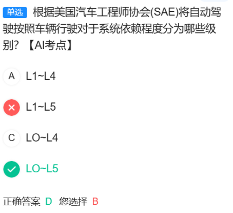


# 402
## 什么是联邦学习？
联邦学习（Federated Learning）是一种分布式机器学习方法，其核心思想是数据不离开本地，多个参与方在本地训练模型，只上传模型参数（如梯度）到中央服务器进行聚合，从而保护数据隐私。题目描述符合联邦学习的基本原理。

# 405
Boosting：通过迭代调整样本权重，训练多个弱分类器，如 AdaBoost、GBDT。
Stacking：将多个基模型的预测结果作为新特征，再训练一个元模型。
Bagging：通过自助采样生成多个训练集，训练多个模型并投票或平均，如随机森林。
Marking：并不是集成学习中的标准术语，属于干扰项。

# 408 
## 问：哪个更能找到最小值？
如果你的目标是找到最深的、全局的最小值（在非凸函数中），那么随机梯度下降（SGD）或其变种（如带动量的SGD）通常被认为潜力最大。 因为它固有的随机噪声帮助它探索更广阔的地形，避免早期陷入一个不好的局部最小值。
但在实践中，小批量梯度下降是最常用和推荐的方法。 因为它在“寻找更好最小值”和“稳定、高效地收敛”之间取得了最佳平衡。它既有机会找到好的最小值，又比纯SGD更稳定、更快。
批量梯度下降（BGD）在寻找全局最小值方面能力最弱，因为它缺乏任何随机性来帮助它逃离局部最优。

# 415
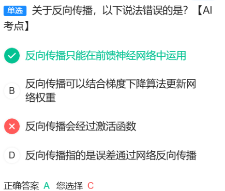

# 417
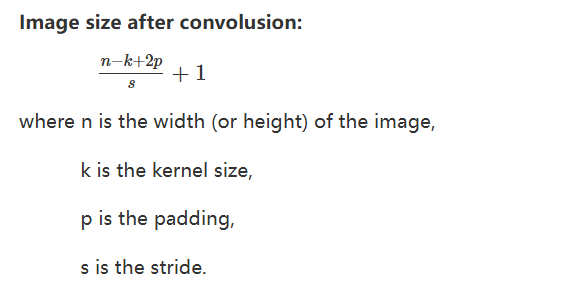

# 421
TensorFlow2.0是一个广泛使用的开源机器学习框架，它提供了多种方法来创建tensor（张量）。在TensorFlow2.0中，`zeros`用于创建全零的张量，`fill`用于创建具有指定形状和值的张量，`constant`用于创建具有恒定值的张量。而`create`不是TensorFlow2.0中用于创建张量的标准方法。

# 422
FusionInsight Manager 是华为公司提供的==大数据管理平台==，它提供统一的界面来管理大数据组件，包括但不限于Hadoop、Spark、Hive等。该平台==简化了大数据集群的部署、监控、运维和扩展==，支持多种部署模式和云服务。它还提供了丰富的分析工具和数据可视化功能，帮助用户从数据中获取洞察。通过FusionInsight Manager，用户可以更高效地管理和分析大数据，从而做出更明智的业务决策。

# 423 
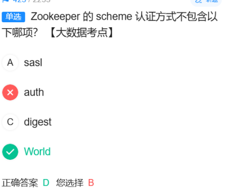

# 424

# 425 
在Fusioninsight HD中，loader从SFTP服务器导入文件时，需要确保文件类型和系统编码的匹配。sequence_file、text_file和graph_file是FusioninsightHD支持的文件类型，其中binary_file为二进制文件类型，无需进行编码转换和数据转换，因此速度最快。

# 426
## 什么是FusionInsight HD？
FusionInsight HD是华为推出的一款企业级大数据平台，基于开源Hadoop生态系统（如HDFS、MapReduce、HBase、Spark等）构建，并增强了安全性、可靠性和管理功能。它主要用于处理海量数据，支持数据存储、计算、分析和机器学习等场景。典型应用包括日志分析、用户行为分析、实时数据处理等。
## 本题解析
在FusionInsight HD系统中，LDAP（轻量级目录访问协议）用于用户身份验证和管理。LDAP数据同步通常指的是将外部LDAP服务器（如Active Directory）中的用户和组数据同步到FusionInsight HD平台中。

## 为什么采用单向同步？下面是一个比喻：
单向同步（实际采用的方式）
流程：每天晚上，数据中心的保安系统会自动从人力资源总部获取最新的员工名单。如果有人离职，他的门禁卡会自动失效；如果有新员工入职，会自动为他制作门禁卡。

权限管理：保安系统（FusionInsight HD）只负责分配大楼内部的权限，比如“允许张三访问A机房”。这个权限信息只保存在大楼本地，不会、也不能反过来写入人力资源的档案里。因为“能进入哪个机房”是数据中心的职责，不是人力资源部的职责。

优点：

职责清晰：人力资源部管人，数据中心管数据权限，权责分离。

安全稳定：人力资源部的权威主名单不会被意外修改。数据中心的一个配置错误不会影响到整个公司的人员组织架构。

数据一致：所有人的基本信息（姓名、部门）都来自一个唯一的、权威的源头，避免了冲突。
# 426
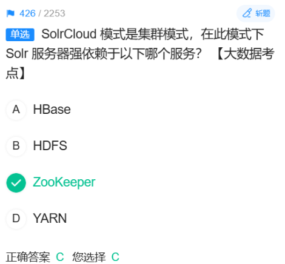

# 427
Loader 是 FusionInsight HD 中负责数据导入导出的组件，可以在 HDFS、HBase、Hive 与外部数据源（如关系数据库、SFTP 等）之间批量传输数据。


# 知识框架
1. 存储框架
负责海量数据的可靠、低成本存储。

HDFS: 基石中的基石。分布式文件系统，用于存储TB/PB级别的数据。

对象存储: 如AWS S3、华为云OBS。云时代的“HDFS”，更具弹性和通用性。

2. 资源管理与调度框架
负责管理集群的硬件资源，是数据中心的“操作系统”。

YARN: Hadoop生态的“大管家”，负责给各种计算任务分配CPU和内存。

Kubernetes: 云原生时代的“新星”，正在成为容器化部署大数据组件的标准。

3. 计算框架
负责对存储的数据或流动的数据进行计算和分析。

批处理
Spark: 绝对主流。基于内存计算，比MapReduce快很多。兼容批处理和流处理。

MapReduce: 第一代计算模型，稳定但慢，现在新项目很少直接用。

流处理
Flink: 真正的流处理之王。低延迟、高吞吐，提供精确的状态管理和事件时间支持。

Spark Streaming: 基于“微批处理”模拟流处理，适合延迟要求不极端的场景。

4. 消息队列
负责连接数据源和计算框架，是实时数据流的“高速公路”。

Kafka: 绝对主流。高吞吐、高可靠，是构建实时数据管道的首选。

5. 查询与分析引擎
让你能用类似SQL的语言去查询和分析海量数据。

Hive: 将SQL转换成MapReduce/Spark任务，降低了使用门槛。

ClickHouse: 极速的OLAP数据库，专为实时分析报表设计。

Presto/Trino: 高效的分布式SQL查询引擎，适合即席查询。

6. 分布式数据库
提供可扩展的随机读写能力。

HBase: 基于HDFS的NoSQL数据库，适合快速查询海量明细数据。

Cassandra: 去中心化的NoSQL数据库，写能力非常强。

7. 数据集成与治理
负责数据的同步、质量和资产管理。

DataX, Sqoop: 数据同步工具，在数据库和HDFS等之间搬运数据。

DataArts Studio, Atlas: 数据治理平台，管理元数据、数据血缘和数据质量。

8. 协调服务
负责在分布式系统中进行协调，比如配置管理、领导者选举。

ZooKeeper: 分布式应用的“协调员”，是Hadoop、Kafka等众多框架的依赖。

总结与趋势
云原生: 所有框架都在向Kubernetes迁移。

流批一体: Flink和Spark都在努力用一个引擎解决流和批两种场景。

湖仓一体: 将数据湖的灵活性和数据仓库的管理性相结合。

对于初学者，建议从 HDFS、YARN、Spark、Flink、Kafka、Hive 这几个最核心的组件开始了解。
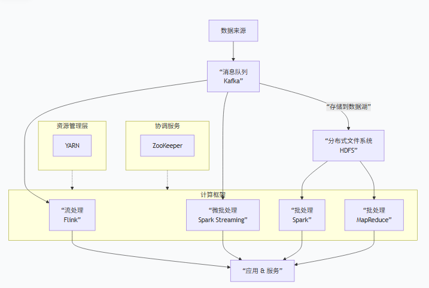


# 概念
**集群**:容器运行所需**云资源的集合**，包含了若干台云服务器、负载均衡器等云资源
**实例（POd）**：由相关的一个或多个容器构成一个实例，这些容器**共享**相同的**存储**和**网络空间**。
**服务**：由**多个相同配置的实例（Pod）**和**访问这些实例（Pod)的规则**组成的微服务。
**容器**:一个通过Docker镜像创建的运行实例，一个节点可运行多个容器。
**镜像**：**一种模板，Docker镜像用于部署容器服务。**


# 知识扩展
## 1
在云存储服务中，**Bucket（桶）和Object（对象）**是两个基本的概念。
Bucket 是容器：Bucket 是对象的容器，用于存储和管理对象。
Object 是内容：Object 是存储在 Bucket 中的具体数据单元。
## 2
在云服务中，AZ 是“Availability Zone”（可用区）的缩写，它指的是一个区域内独立的、隔离的物理数据中心

## 3
虚拟交换机的作用在虚拟化环境中充当**数据包转发**和**流量管理的**中介。
常见的虚拟交换机模型有OVS(标准虚拟交换机。只在服务器内部生效，每个服务器配置一个虚拟交换机)、EVS(增强型交换机。网络转发性能有一定增强)、Dvs(分布式虚拟交换机。华为用的就是这个，横跨多台物理服务器)等。
## 4
### 存储类技术
主流存储类型
**块存储**
块存储就是把裸的硬盘空间分配给服务器，服务器可以按需整理空间，完成**分区、格式化、挂载后**直接用来存放数据。
**文件存储**
文件系统已经准备好了，用户无需管理硬盘细节。
常见的文件共享协议有NFS（Network File System）（主要用于Linux） 、 CIFS （Common Internet File System）（主要用于Windows）
**对象存储**
对象存储 = 智能文件柜，可以同时做到快速访问和共享。
像文件存储一样存数据：用户可以直接把文件存进去，不用做复杂的管理。
性能高：访问速度比普通的文件存储更快。

## 5 为什么zookeeper中的Leader节点在接收到数据变更请求后，先写磁盘再写内存?
### 核心原因：为了满足ZAB协议的“两阶段提交”
ZooKeeper使用ZAB（ZooKeeper Atomic Broadcast）协议来保证集群数据的一致性。这个协议在处理写请求时，核心流程可以简化为两个阶段：
1.  **发现/选举阶段**：选举Leader，并让Leader与Follower同步，确保大家处于同一状态。
2.  **同步广播阶段**：Leader处理所有写请求。这个阶段是回答你问题的关键。
在**同步广播阶段**，Leader处理写请求的流程如下：
**第一步：Leader接收写请求，生成提案（Proposal）**
**第二步：Leader将提案顺序写入本地磁盘文件（事务日志）**
*   **这是你问题中的“先写磁盘”**。
*   这个操作被称为 **“持久化提案”**。
**第三步：Leader将提案广播给所有Follower**
**第四步：Follower接收到提案后，也将其持久化到自己的事务日志，并回复Leader一个ACK**
**第五步：Leader等待“法定数量”的节点（包括自己）都返回ACK**
*   法定数量通常指超过半数的节点（n/2 + 1）。这确保了即使有部分节点宕机，集群依然能正常工作。
**第六步：Leader提交提案（Commit）**
*   Leader现在可以安全地认为这个写操作已经在集群中达成了一致。
*   然后，Leader**将变更应用到内存数据库**。
*   **这是你问题中的“再写内存”**。
**第七步：Leader通知所有Follower提交提案**
*   Follower收到提交通知后，也将变更应用到自己的内存数据库中。
---
### 为什么必须“先写磁盘”？—— 深入解析其必要性
这个设计主要是为了解决以下两个核心问题：
#### 1. **防止数据丢失和保证持久性**
*   **场景**：假设Leader在接收到请求后，不先写磁盘，而是直接更新内存，然后广播给Follower。如果在广播过程中或在收到大多数Follower的ACK之前，Leader**突然宕机**了。
*   **后果**：这个已经更新在Leader内存中的数据就**永久丢失**了。当集群选举出新的Leader时，这个写操作就像从未发生过一样，客户端却可能以为已经成功了。这是不可接受的。
*   **解决方案**：**先写磁盘**。只要提案被持久化到Leader的磁盘日志中，即使Leader立刻宕机，在它恢复后（或者新的Leader被选举出来后），依然可以通过日志恢复出这个未完成的提案，并继续完成广播流程，从而保证数据不丢失。
#### 2. **简化崩溃恢复和保证顺序性**
*   **顺序性是ZooKeeper的核心**：ZooKeeper保证所有更新操作是**严格顺序执行**的。每个提案都有一个全局唯一且递增的ZXID。
*   **场景**：如果Leader在内存中应用了多个变更，但还没来得及持久化到磁盘就宕机了。当它重启后，它的内存状态是空的，但它磁盘上的日志只记录了一部分操作。这会导致状态混乱，无法确定哪些操作是已经对外生效的。
*   **解决方案**：**先写磁盘**。磁盘上的事务日志是所有操作的**唯一真实来源**。通过严格按照“先持久化到日志，再应用”的顺序，可以确保：**任何被应用到内存的数据，其对应的提案一定已经安全地存在于磁盘日志中**。这样在崩溃恢复时，只需要简单地重放一遍磁盘日志，就能准确地恢复到崩溃前的状态，并且严格保持操作的顺序。
### 总结
ZooKeeper Leader **“先写磁盘再写内存”** 这个看似多余的操作，是其作为**分布式协调服务**的立身之本。它通过牺牲一点点写入性能（可以通过组提交、磁盘优化来缓解），换来了：
1.  **数据的持久性**：确保已确认的写操作不丢失。
2.  **崩溃恢复的一致性**：确保在任何故障场景下，集群都能恢复到一致的状态。
3.  **操作的严格顺序性**：保证了全局唯一的操作序列，这是实现分布式锁、选主等核心功能的基础。
这是一个在分布式系统设计中非常经典的 **“用写盘换安全”** 的权衡策略。