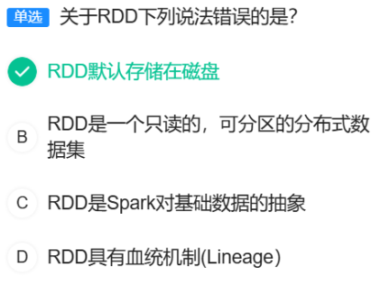
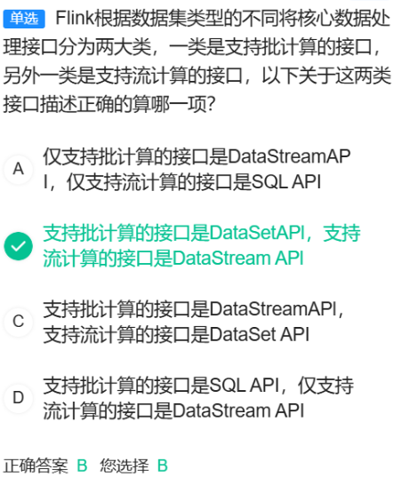
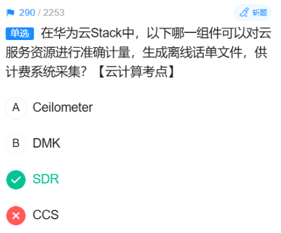

# 1.docker
docker是一个用Go语言实现的开源项目，可以让我们方便的创建和使用容器，docker将程序以及程序所有的依赖都打包到docker container，这样你的程序可以在任何环境都会有一致的表现，这里程序运行的依赖也就是容器就好比集装箱，容器所处的操作系统环境就好比货船或港口，程序的表现只和集装箱有关系(容器)，和集装箱放在哪个货船或者哪个港口(操作系统)没有关系。
因此我们可以看到docker可以屏蔽环境差异，也就是说，只要你的程序打包到了docker中，那么无论运行在什么环境下程序的行为都是一致的，程序员再也无法施展表演才华了，不会再有“在我的环境上可以运行”，真正实现“build once, run everywhere”。
# 2.NUMA
## 2.1 Guest NUMA
其通过向虚拟机呈现NUMA结构，使GUEST OS及其内部应用识NUMA结构，以达到提升应用性能的目的。
## 2.2 Host NUMA
Host NUMA主要提供CPU负载均衡机制，解决CPU资源分配不平引起的VM性能瓶颈问题。
# 3.ARP协议
ARP是一个用于将IP地址转换为物理地址(如：MAC地址)的网络协议。
# 4.DNS协议
其用于将域名转换为IP地址。
# 5.VRM
VRM 是 Virtual Resource Management 的缩写，它是华为 FusionCompute 虚拟化套件的管理核心。VRM 是一个特殊的虚拟机，它负责管理和分配整个集群中的所有计算、存储和网络资源。
它的功能：
-管理所有计算节点（Host）。
-创建、删除、开机、关机、迁移虚拟机。
-管理存储资源。
-实施高可用（HA）、动态资源调度（DRS）等高级功能。
# DRS
DRS规则用于控制虚拟机在集群内主机上的放置策略，主要分为两类：
-关联性/反关联性：规定某些虚拟机或虚拟机与主机是应该运行在一起还是应该分开运行。
-虚拟机到主机：规则规定一组虚拟机与一组主机之间的关联性或反关联性。
# VMM
VMM 的全称是 Virtual Machine Monitor，即 虚拟机监控器。
-作用：
    VMM 是运行在物理硬件之上的软件层，它负责创建、管理和运行虚拟机。
    它抽象底层硬件资源（CPU、内存、I/O 设备）。
    它为每个虚拟机提供虚拟化的硬件环境。
    它确保多个虚拟机之间的隔离和公平调度。
两类架构：
    T-ype 1（裸金属型）：直接运行在硬件上，如 VMware ESXi、Microsoft Hyper-V、KVM（严格来说 KVM 是 Linux 内核模块，也算 Type 1）。
    Type 2（宿主机型）：运行在宿主操作系统之上，如 VMware Workstation、VirtualBox。
# YARN
https://zhuanlan.zhihu.com/p/352958710

# 213
Memory Channel：数据存储在内存中，读写速度最快，性能最高，但进程终止或机器故障时数据会丢失，因此不考虑数据安全性时速度最优。
File Channel：数据写入磁盘，可靠性高，但速度较慢。
JDBC Channel：数据存储到关系型数据库，性能更低。
HDFS Channel：数据直接写入 HDFS，适用于大数据量持久化，但延迟较高。
# 215(在本节顺便对HBase的知识体系进行总结)
HBase 是一个建立在 ==Hadoop== 文件系统（HDFS）之上的、分布式的、可扩展的 NoSQL 数据库，专门用于存储和处理海量的稀疏表数据。
HBase 的 RowKey 设计原则之一是==长度不宜过长且尽量均匀分布==，避免热点问题。
用户ID：通常是固定长度的数字或哈希值，分布均匀，适合做 RowKey。
用户名：长度不固定，可能包含特殊字符，且分布不均匀（例如常见用户名集中），容易导致热点，不适合做 RowKey。
身份证号：长度固定，虽然前几位可能因地区集中，但整体分布相对均匀，可通过反转或散列优化，仍可用作 RowKey。
手机号：长度固定，分布较均匀，也可通过散列优化，适合做 RowKey。

## 分裂[# 218]()[# 234]()
- Split为了减少Region中数据大小，从而将一个Region分裂成两个Region。
- 在 HBase 的 Split 过程中，整个表不会暂停服务。只有被分裂的那个特定 Region 会短暂下线进行分裂操作，而表中其他的 Region 仍然可以正常提供读写服务。
- Split过程中并没有真正的将文件分裂，仅仅是创建了引用文件。

## 合并 [# 216]()
在 HBase 中，当频繁的写入和删除操作导致存储层产生大量小文件（HFile）时，会严重影响查询性能，因为每次读取可能需要访问多个 HFile。
Compaction（合并） 是 HBase 的一个核心机制，用来减少通过一个Region同一个ColunFanily下的文件数量[# 247]()，它分为两种：
Minor Compaction：将多个较小的 HFile 合并成更大的 HFile。
Major Compaction：将一个 Region 中的所有 HFile 合并为一个 HFile，并清理已标记删除的数据。

==执行 Compaction 可以减少 HFile 数量，提升读取效率，是解决此类性能问题的标准操作。==
## HBase中的数据存储的文件格式是==HFile==。[# 235]()
## HBase在读取数据是率先读取==MemStore==数据[# 276]()

- HBase元数据Meta Region路由信息保存在Root表中。

- HBase中的region的物理存储单元是ColumnFamily。
# 217(221)
-MapReduce、Spark、Flink 是什么？
答：它们都是==分布式大数据计算框架==，用于在海量数据上进行并行处理。
-MapReduce（只支持批处理）、Spark（支持批处理和微批流处理）、Flink（支持流处理和批处理）三者都共同支持的处理方式是批处理。

## 什么是批处理？什么是流处理？
1、批处理：处理已经存在的、一批完整的海量数据。
好比：您月底一次性计算整个月的总开销。
2、流处理：处理持续生成的、源源不断的数据流。
好比：您每花一笔钱，手机记账APP就立刻更新您的实时余额。

## 什么是YARN?
YARN 的作用是==将计算框架（如 MapReduce, Spark, Flink）与资源管理分离开来==，由一个统一的中央调度器来管理整个集群的资源（CPU、内存），并按需分配给各个计算任务，从而让一个集群能够同时运行多种计算框架。

- Spark的自带的资源管理框架是==Standaline==
- [#230]()

- MapReduce程序中的map任务数由==该任务所计算的数据块数量==决定的
# 218
HBase 是一个建立在 Hadoop 文件系统（HDFS）之上的、分布式的、可扩展的 NoSQL 数据库，专门用于存储和处理海量的稀疏表数据。

在 HBase 中，当指定了 Split Keys（预分区键）时，表的 Region 数量计算公式为：
Region 数量 = Split Keys 的数量 + 1
题目中给出的 Split Keys 为：9，E，a，z
这是 4 个 Split Keys。
因此，Region 数量 = 4 + 1 = 5

# 221
-什么是“集群”？
在IT领域，“集群” 指的是将多台计算机服务器通过网络连接起来，协同工作，对外就像一个单一的、功能更强大的系统。

MRS集群是华为云提供的一款托管式大数据集群服务。 它让企业能够一键式部署和管理主流的大数据框架（如Hadoop, Spark, HBase, Kafka等），而无需关心底层的基础设施。

选项D、VPC子网是您在云上拥有的一个私有、隔离且可自定义的网络区域，是您部署云资源（如MRS集群、ECS服务器）的专属“小区”。

# 223
A 快照机制实现了文件系统常见的快照机制，保证数据误操作时，能及时恢复
正确。HDFS 确实支持快照功能，可以对指定目录创建快照，用于防止用户误操作或软件故障导致的数据损坏。
B 采用日志机制操作元数据，同时元数据存放在主备NameNode上
正确。这是 HDFS 高可用性的核心机制。NameNode 通过写 EditLog 日志来记录所有元数据操作，并且元数据会在主备 NameNode 之间同步，确保故障时能快速切换。
C 节点性能较高的DataNode会存放更多的数据
错误。HDFS 的默认数据块放置策略==主要考虑的是可靠性和均匀利用网络带宽==，而不是根据 DataNode 的性能高低来分配数据量。
D DataNode向NameNode周期上报失败任务，NameNode发起副本重建动作以恢复丢失副本
正确。DataNode 会通过心跳机制定期向 NameNode 汇报其存储的所有数据块列表。如果 NameNode 检测到某个数据块的副本数量因 DataNode 宕机或磁盘损坏而低于预设值，它会在新可用的 DataNode 上发起副本复制任务，以恢复副本数。

# 224
 A. 在点对点消息系统中，可能会有多个消费者同时消费数据，因此不能保证数据处理的顺序
不正确。这是对点对点（P2P/Queue）模式的错误描述。
在标准的点对点模型中，一个队列通常由同一个消费者组内的一个消费者消费，==消息在被消费后会被标记为已处理或删除，从而避免了多个消费者同时处理同一个消息==。
更重要的是，在这种模式下，如果只有一个消费者，或者消息被锁定给特定消费者处理，是可以保证消息的处理顺序的。因此，“不能保证顺序”的说法过于绝对且不符合点对点模式的核心特点。
题目说“可能会有多个消费者同时消费数据”混淆了概念。在P2P中，多个消费者是从同一个队列取，但一条消息只会被一个消费者取走，不会出现多个消费者同时消费同一条数据的情况。
B. 在点对点消息系统中，当一个消费者消费了队列中的某条数据之后，该条数据则从消息队列中删除
正确。这是点对点模式的典型特征，确保消息不会被重复消费。
C. 分布式消息传递有两种主要的消息传递模式，点对点传递模式、发布订阅模式
正确。这是消息中间件领域公认的两种基本模式。
D. 在发布订阅消息系统中，同一条数据可以被多个消费者消费，数据被消费后不会立马删除

# 225

# 225
YARN中的几种调度器：
A. Capacity调度器 ✓
优势：可以将集群资源划分为多个队列，为不同队列分配固定的资源容量
适用场景：适合为MapReduce和Spark分别分配独立的资源队列，保证两种任务都能获得稳定的资源分配
资源隔离：避免实时任务和离线任务相互影响
B. FIFO调度器
按提交顺序执行任务，先进先出
==不适合混合工作负载==，高优先级任务可能被阻塞
C. Fair调度器
在所有运行的应用之间公平共享资源
但对于需要保证SLA的服务级别协议场景，资源保障不够稳定

- 对A、C进行辨析：
A. Capacity调度器（容量调度器）
核心思想：预先分配固定资源
就像租房子：MapReduce租了60%的房间，Spark租了40%的房间
C. Fair调度器（公平调度器）
核心思想：动态公平分享
就像自助餐：大家按需取用，谁饿了谁多吃

# 226

- RDD的存储特性：
RDD默认存储在内存中，这是Spark相比MapReduce性能优势的关键
只有在内存不足时，才会将部分数据溢出到磁盘
也可以通过持久化策略手动控制存储级别（内存、磁盘等）
- RDD是一个==只读的==，==可分区的==分布式数据集
- RDD是Spark对基础数据的抽象
- RDD具有血统机制(Lineage) 

-在 Spark 中，RDD 的操作分为两大类[# 251]()：
- Transformation（转换）：
特点：惰性执行。它们只是定义了新的 RDD，但不会立即计算。
返回值：返回一个新的 RDD。
目的：构建计算的逻辑图（DAG）。
- Action（动作）：
特点：立即执行。它们会触发一个作业（Job）的运行，将数据计算出来并返回结果或输出到外部存储。
返回值：返回一个非 RDD 的值（如 Scala 集合、一个具体数值）或者直接将数据输出。（==对数据进行批处理==）
目的：真正开始计算并产生结果。
- 常见的 Action 算子举例(扩展)：
collect()：将数据拉取到驱动程序。
count()：返回 RDD 中的元素个数。
first()：返回 RDD 中的第一个元素。
take(n)：返回 RDD 中的前 n 个元素。
reduce(func)：通过函数 func 聚合 RDD 中的所有元素。
foreach(func)：对 RDD 中的每个元素应用函数 func。
saveAsTextFile(path)：将 RDD 保存为文本文件。

# 227
标准Kafka配置中acks的有效值是：0, 1, all(-1)
A. acks=0
含义：Producer不等待任何确认
效果：发送即认为成功，完全不关心数据是否被Broker接收
风险：可能丢失数据
C. acks=1 
含义：至少等待Leader成功将数据写入本地Log
效果：Leader写入成功就返回确认，不等待Follower同步
风险：如果Leader刚写入就故障，且Follower尚未复制，可能丢失数据
D. acks=all
含义：等待ISR（In-Sync Replicas）中的所有副本都成功写入
效果：要求Leader和所有同步的Follower都写入成功
保证：最强的一致性，但延迟最高

# 229

# 233
ZooKeeper 的原子性 特指其数据更新的特性，即 一次数据更新操作（如 setData、create）要么完全成功生效，要么完全失败回滚，不会出现部分更新的中间状态。
- 什么是ZooKeeper?
一个生动的比喻：动物园管理员
想象一个真实的动物园：
动物园里有各种动物（分布式应用中的各个节点）。
管理员（ZooKeeper）负责：
记录哪些动物在哪个笼子（维护配置信息）。
如果某个动物（比如狮子）被移走了，他会立刻通知所有饲养员（服务发现与通知）。
当需要给危险的动物喂食时，他确保同一时间只有一个饲养员能进入笼子（分布式锁）。
他按照先来后到的顺序处理饲养员的请求（保证操作顺序）。
没有这个管理员，动物园就会陷入混乱：饲养员不知道动物在哪，可能两个人同时进入一个危险的笼子。ZooKeeper 就是在分布式系统中扮演这个“管理员”的角色。
[# 236]()
ZooKeeper的作用：
保证各节点上数据的一致性
选举Master节点
存储集群中服务器信息

[# 239]()
## 什么是Flume？
Flume 是一个分布式的、高可靠的、高可用的海量日志数据采集、聚合和传输系统。 你可以把它想象成数据世界的 “超级搬运工”，负责将各个地方产生的数据（尤其是日志数据）安全、高效地“搬运”到中央存储系统（如 HDFS、Kafka）中

## Flume 的传输过程包含两个事务：（简称“事务机制”，正是数据机制的存在使得FLume具有一定的可靠性）
*Put 事务*：Source 将采集到的事件（Event）批量放入 Channel。
*Take 事务*：Sink 从 Channel 中批量取出事件，并发送到下一个目的地（如 HDFS、Kafka）。
只有当事务成功提交后，数据才会被确认已移入或移出 Channel。如果过程中失败（如网络问题），事务会回滚，数据会保留在 Channel 中并等待重试。这种机制确保了数据在传输过程中不会丢失。

## Flume与Kafka的关系： 
Flume 和 Kafka 的关系可以概括为：它们是数据管道中协同工作的“采集员”和“高速公路”，经常配合使用，而==不是相互替代的关系==。
**Flume**：数据的“采集员”和“搬运工”
核心职责：从数据源（如日志文件、端口）可靠地采集数据，并传输到下一个目的地。
**Kafka**：数据的“高速公路”或“中央枢纽”
核心职责：作为高吞吐量的消息队列，缓冲和分发实时数据流。

# 240
- ClickHouse 是一个开源的列式分析型数据库
ClickHouse 的核心优势在于对海量结构化/半结构化数据的实时分析。而 “非结构化数据” 的处理超出了它的设计范围，因此描述错误的是选项 C。

# 243
ElasticSearch有==基于全文检索==的查询类型。

# 246
“结果可溯” 是什么意思？就是要求结果精确、可重现。比如，税务部门要查你上个月的总销售额，这个数字必须是唯一且准确的，今天查和明天查必须一样。

- 为什么B是对的？理由如下：
Event Time（事件时间） = 事实发生的时间
你在 12:00:00 这一刻，在手机上点击了“提交订单”。这个 12:00:00 就是 Event Time。它是这个事件的“出生证明”上的时间，是不可篡改的。
Processing Time（处理时间） = 系统处理的时间
你的订单数据需要经历一个漫长的旅程：
从你的手机传到基站。
经过移动网络。
到达外卖平台的后台服务器。
可能进入 Kafka 等消息队列排队。
最后才被流计算程序（如 Flink）消费和处理。
流计算程序在 12:00:02 这个时刻才真正开始处理你的这条订单数据。这个 12:00:02 就是 Processing Time。

# 253 

- Hive 是构建在 Hadoop 之上的一个数据仓库工具。
背景：HDFS 里存了海量数据，但想用传统的 SQL 去查询分析这些数据非常困难。
Hive 的作用：它把结构化的数据文件映射成一张数据库表，并提供了一种类似于 SQL 的查询语言，叫做 HQL。

## Hive 中的数据组织模型：分区和分桶[# 261]()。
### 分区
是什么--：按某一列的值（如日期、地区）将大表分割成不同的子目录。
为什么：为了快速过滤。查询时只需扫描相关分区目录，避免全表扫描。
特点：
物理上是目录。
==数量不固定，随数据增加==。
例子：按 dt=20231027 分区，所有这天的数据都在 /dt=20231027/ 这个目录下。
### 分桶
是什么：在分区内（或整个表），按某列值的哈希结果将数据分散到==固定数量的文件==中。
什么：为了提高采样和连接效率。数据被均匀打散，便于快速定位。
特点：
物理上是文件。
数量固定，建表时指定。
例子：按 user_id 分32个桶，ID为123的用户数据一定在某个特定编号的文件里。

### 问：为什么“桶”对应的物理结构是“文件”，而不是“目录”？
答：当Hive执行分桶时，它会：
计算分桶列的哈希值
根据桶数取模，确定这条记录属于哪个桶
==将属于同一个桶的所有数据写入同一个文件==

# 260

# 262

# 265
Kafka 的设计哲学是作为一个统一的、集中的实时数据管道，所有生产者和消费者都连接到这里。最佳实践是==避免创建多个 Kafka 集群进行级联==，因为这会增加复杂性和延迟。

# 266 
## 问：Topic 是什么？
可以把 Kafka 想象成一个消息系统或数据流通的管道。
Topic（主题） 就是这条管道中，对不同类型数据进行分类的标签。
一个生动的比喻：报社
Kafka 集群 = 整个报社
Topic = 不同的报纸专栏（比如：体育专栏、财经专栏、娱乐专栏）
消息 = 一篇篇的新闻报道
生产者 = 记者，他们撰写稿件并投递给特定的专栏。
消费者 = 读者，他们订阅自己感兴趣的专栏来阅读新闻。
所以：
“每条发布到Kafka的消息都有一个类别，这个类别被称为Topic” —— 这句话完全正确。就像每篇新闻稿都必须属于一个专栏。

## 答案解析
A. 每个Topic只能被分成一个partition(区)
不正确。这是对 Partition 概念的严重误解。
Partition（分区） 是 Topic 的细分，用于并行处理和提高吞吐量。
一个 Topic 可以被分成多个 Partition（比如10个，100个），这是 Kafka 实现高并发和高可用的核心机制。
说“只能被分成一个”是完全错误的。
B. 每个Partition在存储层面对应一个log文件，log文件中记录了所有的消息数据
正确。在 Kafka 的每个 Broker（服务器）上，每个 Partition 物理上就是一个有序的、只能追加的日志文件。所有发送到这个 Partition 的消息都按顺序记录在这个文件里。
C. 每条发布到Kafka的消息都有一个类别，这个类别被称为Topic，也可以理解为一个存储消息的队列
正确。这正确定义了 Topic，如上文的报社比喻。
D. Topic的Partition数量可以在创建时配置
正确。在创建 Topic 时，num.partitions 是一个关键的配置参数，用于指定这个 Topic 应该被分成多少个 Partition。

# 267
## MapReduce 编程模型的基础知识。
在 MapReduce 中：
Map 阶段：处理输入数据，输出中间结果。
Shuffle 阶段：根据 Key 将 Map 输出的中间结果进行排序、分组，然后分发到不同的 Reducer。
Reduce 阶段：每个 Reduce 任务处理分配给它的那一部分中间数据。每个 Reduce 任务会生成一个独立的输出文件。
关键规则： 一个 Reduce 任务对应一个输出文件。
因此，题目中明确指出有 5 个 Reduce 任务，那么最终就会产生 5 个输出文件。

# 269
A、这不是传统数据处理的瓶颈，因为它根本不是传统数据处理的目标。
传统数据处理（如 nightly ETL、T+1报表）的核心模式是批处理。它的设计目标就是处理已经存在的、静态的、成批的数据。
它本身就没有被设计用来处理持续不断的流数据。所以，“无法实时写入流数据”不是它的“瓶颈”，而是它的固有特性。==一个东西不具备的功能，不能称之为瓶颈==。

# 270
## 什么是KDC?
KDC 是一个你和你想要访问的所有服务都共同信任的“超级安全中介”。它的唯一职责就是安全地为你和你要访问的服务“牵线搭桥”，分发用于安全通信的“钥匙”。
## 答案解析：
A. Kerberos==支持双向鉴别==，Kerberos的Server端通过返回Client发送的时间戳，向Client提供验证自己身份的手段
正确。这是 Kerberos 双向认证的关键步骤。客户端在向应用服务器发送的请求中包含一个认证器（Authenticator），其中包含时间戳。应用服务器解密后，会用自己的会话密钥加密这个时间戳并返回给客户端。客户端如果能正确解密并匹配，就证明了应用服务器的身份。

✅ B. 由KDC代为发送Authenticator和Session Ticket有效提高性能
错误。这是对协议流程的误解。

==Authenticator（认证器）是由客户端生成，并直接发送给应用服务器的，KDC 从不代为发送 Authenticator==。
==Session Ticket（服务票据，即 TGS）是由 KDC 生成并发送给客户端的，然后由客户端自己持有并在需要时发送给应用服务器。KDC 并不会“代为发送”给服务器。==

这个描述混淆了不同消息的发送方和接收方，因此是错误的。

C. 用于认证的Session key是short term key只在一次会话中有效，有效防止暴力破解
正确。会话密钥生命周期很短，仅在一次特定的客户端-服务器会话期间有效。即使被破解，危害也被限制在单次会话内，大大增强了安全性。

D. 每个请求都以时间戳进行标记，有效防止重放攻击
正确。客户端生成的 Authenticator 中包含一个时间戳。服务器会检查这个时间戳是否在可接受的时间窗口内，并缓存近期收到的时间戳。如果收到一个重复或过期的时间戳，请求就会被拒绝，从而有效防御重放攻击。

# 271

DataStream API 是用于流计算的，而不是批计算。SQL API 是高级 API，它既可以用于流计算也可以用于批计算。

# 272
Kafka 中的 Offset（偏移量）是一个 64 位整数，它是一个从 0 开始单调递增的 long 类型数字。它绝对不是 String 类型。所以A错。

# 273
## HBase中的Rowkey是什么？
RowKey 是 HBase 表中每一行数据的唯一标识符，相当于关系型数据库中的主键。它决定了你的数据存储在哪个区域，以及数据在硬盘上的排序顺序。

## 答案解析：
好的，我们彻底搞懂这些操作。就用刚才那个 **HBase用户表** 的例子。

**假设我们的表是这样的，RowKey是用户ID：**

| RowKey (用户ID) | info:name | info:phone |
| :--- | :--- | :--- |
| **user001** | 张三 | 13811111111 |
| **user002** | 李四 | 13922222222 |
| **user003** | 王五 | 13733333333 |

**业务需求：** 我们想通过手机号 `13922222222`，快速找到对应的用户ID（`user002`）。

---

### 1. Get - "精准抓取"

*   **是什么**：像用**字典查字**。你必须**知道要查的字的准确拼音（RowKey）**，然后直接翻到那一页。
*   **怎么用**：`Get("user002")`
*   **结果**：直接返回 `user002` 这一行的所有数据（李四，13922222222）。
*   **特点**：**速度极快**，是HBase最高效的查询方式。
*   **用在我们的需求上**：**行不通！** 因为我们不知道手机号`13922222222`对应的RowKey（`user002`）是什么。我们无法使用`Get`。

---

### 2. Scan + ValueFilter - "全库盘查"

*   **是什么**：
    *   `Scan`：像**把图书馆从A到Z所有书架全部翻一遍**。
    *   `ValueFilter`：你给图书管理员一个**标准**，比如“找出所有内容里提到‘孙悟空’的书”。
*   **怎么用**：`Scan` 整个表，然后设置一个 `ValueFilter`，条件是 `value = '13922222222'`。
*   **执行过程**：
    1.  HBase 从 `user001` 开始读。
    2.  检查 `user001` 这行的所有值，发现电话是 `13811111111`，不匹配，跳过。
    3.  读 `user002`，发现电话是 `13922222222`，匹配！返回这一行。
    4.  继续读完 `user003`...
*   **结果**：最终能找到 `user002`。
*   **特点**：**功能上可以实现，但性能是灾难！** 因为无论你的数据有多少（1万行还是10亿行），它都需要扫描**整个表**。就像为了找一个人而排查全国人口，太慢了。
*   **用在我们的需求上**：**不合适**，无法满足“快速查询”的要求。

---

### 3. 为什么选项A "Get与valueFilter同时使用" 是错误的？

这是一个**概念性错误**。

*   `Get` 操作是**基于已知的RowKey进行精确定位**的。它假设你已经知道你要哪一行了，所以它根本**不需要、也不支持** `ValueFilter` 这种“过滤”机制。
*   这就好比你说：“我知道这本书的**具体索书号是A123**，请帮我用`内容过滤`的方式找到它。” 这本身就是矛盾的。你既然都知道索书号了，直接去拿就行了，还过滤什么内容呢？

所以，`Get` 和 `ValueFilter` **不能同时使用**。选项A描述了一个不存在的操作。

---

### 4. 正确的解决方案：二级索引

这就像我们为图书馆**额外制作了一份按“书名”排序的索引卡片**。

*   **主表**（按用户ID排序）：
    | RowKey (用户ID) | info:name | info:phone |
    | :--- | :--- | :--- |
    | user001 | 张三 | 13811111111 |
    | user002 | 李四 | 13922222222 |
    | user003 | 王五 | 13733333333 |

*   **二级索引表**（按手机号排序）：
    | RowKey (手机号) | 用户ID |
    | :--- | :--- |
    | **13733333333** | user003 |
    | **13811111111** | user001 |
    | **13922222222** | user002 |

**现在，查询流程变成了：**

1.  在**索引表**里执行一次高效的 `Get("13922222222")`，瞬间得到结果：`user002`。
2.  在**主表**里再执行一次高效的 `Get("user002")`，瞬间得到用户的完整信息。

**这个过程只进行了两次毫秒级的 `Get` 操作，完全避免了全表扫描，真正实现了“快速查询”。**

---

### 总结

| 操作 | 类比 | 速度 | 解决我们需求？ |
| :--- | :--- | :--- | :--- |
| **Get** | 按学号查学生 | **极快** | **否**（不知道学号） |
| **Scan + ValueFilter** | 全校点名找叫“李四”的人 | **极慢**（全表扫描） | **功能可行，性能不可行** |
| **二级索引** | 先查《姓名-学号对照表》，再按学号查 | **快**（两次Get） | **是，最佳方案** |

所以，原题的正确选项是 **D. 创建二级索引**。它通过空间换时间，将非RowKey的查询转换成了高效的RowKey查询。

# 274 
>考察对 Flume Channel 特性的准确理解

A. Memory channel中消息存放在内存中，提供高吞吐，但可能丢失数据
正确。Memory Channel 将事件存储在内存队列中，读写速度极快，因此吞吐量很高。==但一旦 Flume Agent 进程异常终止，内存中尚未传输的数据就会全部丢失，可靠性低==。

✅ B. JDBC Channel内置的derby数据库，对event进行了持久化，但不提供高可靠性
错误。这是对 JDBC Channel 特性的矛盾描述。

JDBC Channel 使用内嵌的数据库（如 Derby）或外部数据库（如 MySQL）来持久化事件，将事件写入磁盘数据库。

正是因为将数据持久化到了数据库，它才能提供高可靠性，确保在 Agent 失败时数据不会丢失。

因此，正确的描述应该是：“...对event进行了持久化，因此提供高可靠性”。原选项后半句“但不提供高可靠性”是完全错误的。

C. Channel支持事务机制，提供较弱的顺序保证
正确。Flume Channel 支持事务（Put 事务和 Take 事务），这保证了单个批次的原子性。它只能保证在同一个 Channel 中，事件被处理的大致顺序，但不能提供严格的、强保证的顺序，尤其是在多个Source或Sink的情况下。

D. File Channel支持对数据持久化，但需要配置数据目录和checkpoint目录
正确。File Channel 通过将数据写入本地磁盘文件来实现持久化。配置时，必须指定 dataDirs（数据存储目录）和 checkpointDir（检查点目录，用于恢复状态），这是其标准配置要求。

# 275
==RDD：这是 Spark 最基础的数据抽象==。
特点：弹性、分布式、可并行操作。
缺点：Spark 引擎无法优化其执行过程，因为不知道数据的内部结构。性能相对较低。
==DataFrame：在 RDD 之上增加了 Schema（结构信息）==。
可以看作是 DataSet[Row]，即一个存放着 Row 对象的 DataSet。
特点：由于有了结构信息，Spark 的 Catalyst 优化器 可以对其执行计划进行深度优化（如谓词下推、列裁剪），Tungsten 执行引擎也能进行高效的列式内存管理和代码生成。
缺点：是弱类型的。在编译时无法发现类型错误，只能在运行时发现。
==DataSet：在 DataFrame 之上增加了 强类型==。
它是 DataFrame API 的扩展，提供了编译时类型安全。
特点：同时拥有 RDD 的类型安全 和 DataFrame 的性能优势。
它享受与 DataFrame 相同的 Catalyst 优化 和 Tungsten 高效执行。

# 280（没懂）
在华为云Stack中，在部署ManageOne平台时，需要部署多台虚拟机来进行管理和运维，其中ManageOne-Deploy是用来管理部署任务和管理模板的，ManageOne-Service是提供云服务管理功能的，ManageOne-vAPP是提供虚拟机应用平台服务的，ManageOne-Tenant是用来管理租户的。因此，选项C不是安装时必须安装的管理虚拟机。因此，答案是C.ManageOne-vAPP。
# 281
OpenStack 是一个开源的、用来构建和管理公有云、私有云基础设施的云操作系统。
# 290

# 291
A. VDC管理员
可以管理。VDC管理员在其负责的虚拟数据中心内拥有较高的管理权限，包括管理和部署资源栈，以服务于该VDC内的业务需求。
✅ B. VDC业务员
无法管理。这个角色的权限通常是最低的，主要限于使用已经部署好的云资源（如开关虚拟机、使用云硬盘），而没有权限去创建、修改或删除整个资源栈。资源栈管理属于基础设施的编排和自动化部署范畴，超出了业务员的操作范围。
C. 代维管理员
可以管理。代维管理员是受委托代表其他VDC进行运维操作的角色，通常被授予了相应的权限，可以管理其代维范围内的资源栈。
D. 运营管理员
可以管理。运营管理员是全局性的高级管理员，拥有整个云平台的最高权限，自然可以管理任何资源栈。
## 什么是资源栈？
资源栈 = 通过模板自动化创建出来的一整套、有逻辑关联的云应用环境。
# 293
A. Swift管理副本的粒度是对象
正确。Swift 确实是以“对象”为单位来管理其副本的。当你上传一个文件（对象），系统会为这个特定的对象创建多个副本。
B. 每个副本存放在不同的Zone中
错误。这是对副本放置策略的过度绝对化描述。
Zone 是 Swift 中一个容错单元，可以理解为一个机房、一个机架或一组磁盘。
Swift 的副本放置策略目标是 “将副本分散到不同的故障域”，其核心是保证副本在不同的节点上。
最佳实践确实是将副本放置在不同的 Zone 中以提供更高的可靠性，但这不是强制要求。在一个小型部署中，可能只有一个 Zone，那么所有副本就只能存放在同一个 Zone 的不同节点上。
因此，说“每个副本都存放在不同的 Zone 中”是不准确的。
C. 对象的副本是通过Partition的副本来实现的
正确。这描述了 Swift 底层的实现机制。
Swift 不是直接复制整个文件，而是将对象数据切分成更小的块，这些块分布在不同的分区中。
数据的可靠性是通过保证这些分区有多个副本来实现的，从而间接保证了对象本身的多个副本。
D. Swift为每个对象都建立了一定数量的副本
正确。这是 Swift 保证数据可靠性的核心机制。默认情况下，一个对象会有 3 个副本，分布在不同的存储节点上。

# 294

# 295
A. 用户可以对文件系统进行管理，包括容量调整、查看、卸载、还原、删除文件系统等
正确。这是SFS提供的基本管理功能，用户可以通过控制台或API对文件系统进行全生命周期管理。

✅ B. SFS至多可以弹性伸缩至TB规模
错误。这个描述严重低估了SFS的扩展能力。

华为云SFS的弹性文件服务（特别是高性能型/SFS Turbo）可以轻松扩展至PB（Petabyte）级别，而不仅仅是TB（Terabyte）级别。

1 PB = 1024 TB，因此说“至多TB规模”是一个明显的错误，没有体现出SFS的海量扩展能力。

C. 使用弹性文件服务前，必须要创建一个文件系统
正确。这是使用任何文件服务的基本前提。用户需要先创建文件系统实例，然后才能挂载和使用。

D. 创建文件系统后，您需要将文件系统挂载至云服务器才能使用
正确。文件系统创建后，需要像挂载硬盘一样，将其挂载到ECS云服务器上，然后才能在服务器上像使用本地目录一样访问文件系统。

# 297
✘ A. 瓶颈分析
能满足。这是典型的全局运维场景。运营者需要找出整个云平台中性能的瓶颈点，例如：哪些物理主机的CPU使用率持续过高？存储IOPS是否达到上限？这能帮助其进行优化和扩容，保障平台整体性能。

B. 闲置分析
能满足。这是重要的成本优化场景。运营者需要从全局视角找出那些被分配但长期未被使用的资源（如空闲的云主机、未被挂载的云硬盘），并将其回收或重新利用，以提高整个平台的资源利用率和经济效益。

✔ C. 应用分析
不能满足。应用分析通常指的是对部署在云平台上的某个具体业务应用的性能、调用链、用户体验等进行深入分析（例如使用APM工具）。这属于租户视角或业务运维视角的范畴，而不是云平台运营者进行基础设施全局管理的核心诉求。ManageOne作为云管理平台，其主要职责是管理“云资源”，而非深入到租户的“业务应用”内部。

D. 容量分析
能满足。这是最核心的全局分析场景之一。运营者需要基于历史数据和趋势，预测未来计算、存储、网络资源的消耗情况，以便进行准确的容量规划，避免资源耗尽的风险。

# 298
✅ A. 审批流程
不属于日常运维。审批流程的创建、配置和管理属于系统管理或运营管理的范畴。它是一项事前设定的规则和策略，而不是运维人员每天需要执行的例行性维护工作。日常运维关注的是系统的运行状态、稳定性和数据安全，而不是审批规则的设定。

B. 备份管理
属于日常运维。这是运维的核心职责之一，包括定期为系统数据和配置创建备份、检查备份是否成功、验证备份数据的可用性等，以确保在发生故障时能够快速恢复。

C. 自动作业
属于日常运维。运维人员会创建和管理自动作业，用于执行周期性的维护任务，例如定时清理日志、定期执行健康检查、在凌晨进行数据同步等，以实现运维的自动化和规范化。

D. 健康巡检
属于日常运维。这是最典型的日常运维工作。运维人员需要定期（如每天或每周）检查系统中各个服务和组件的状态、性能指标、日志是否存在错误、资源使用率等，以便及时发现潜在问题并处理，防患于未然。

## 问：“华为Stack”中审批流程的作用是什么？
审批流程 是在一个组织内部，为了对某项申请进行审核和批准而预设的、标准化的步骤序列。它确保了重要的请求能够按照公司的制度和权限，由正确的人进行核查和决策。
想象一下，你要申请一笔项目经费，公司规定了一套固定的流程，就像一张需要逐级盖章的“申请表”
# 299
A、现代的企业级云管理平台，包括ManageOne，为了与企业现有的ITSM流程集成，通常都支持与外部审批系统的对接。它可以通过API接口或工作流引擎调用外部系统的审批流程，实现审批过程的统一管理。因此，说“不支持”是不准确的。
C、运营管理员是最高级别的租户管理员，其创建的审批流程属于全局性配置，对整个云平台的所有VDC都可见可用。
D、 VDC管理员或代维管理员创建的审批流程在本VDC及下级VDC内可见
正确。这体现了审批流程的作用域概念。VDC管理员创建的流程，其权限范围被限定在其管理的VDC及下级VDC内，实现了多租户环境下的权限隔离和管理自治。

# 知识框架
1. 存储框架
负责海量数据的可靠、低成本存储。

HDFS: 基石中的基石。分布式文件系统，用于存储TB/PB级别的数据。

对象存储: 如AWS S3、华为云OBS。云时代的“HDFS”，更具弹性和通用性。

2. 资源管理与调度框架
负责管理集群的硬件资源，是数据中心的“操作系统”。

YARN: Hadoop生态的“大管家”，负责给各种计算任务分配CPU和内存。

Kubernetes: 云原生时代的“新星”，正在成为容器化部署大数据组件的标准。

3. 计算框架
负责对存储的数据或流动的数据进行计算和分析。

批处理
Spark: 绝对主流。基于内存计算，比MapReduce快很多。兼容批处理和流处理。

MapReduce: 第一代计算模型，稳定但慢，现在新项目很少直接用。

流处理
Flink: 真正的流处理之王。低延迟、高吞吐，提供精确的状态管理和事件时间支持。

Spark Streaming: 基于“微批处理”模拟流处理，适合延迟要求不极端的场景。

4. 消息队列
负责连接数据源和计算框架，是实时数据流的“高速公路”。

Kafka: 绝对主流。高吞吐、高可靠，是构建实时数据管道的首选。

5. 查询与分析引擎
让你能用类似SQL的语言去查询和分析海量数据。

Hive: 将SQL转换成MapReduce/Spark任务，降低了使用门槛。

ClickHouse: 极速的OLAP数据库，专为实时分析报表设计。

Presto/Trino: 高效的分布式SQL查询引擎，适合即席查询。

6. 分布式数据库
提供可扩展的随机读写能力。

HBase: 基于HDFS的NoSQL数据库，适合快速查询海量明细数据。

Cassandra: 去中心化的NoSQL数据库，写能力非常强。

7. 数据集成与治理
负责数据的同步、质量和资产管理。

DataX, Sqoop: 数据同步工具，在数据库和HDFS等之间搬运数据。

DataArts Studio, Atlas: 数据治理平台，管理元数据、数据血缘和数据质量。

8. 协调服务
负责在分布式系统中进行协调，比如配置管理、领导者选举。

ZooKeeper: 分布式应用的“协调员”，是Hadoop、Kafka等众多框架的依赖。

总结与趋势
云原生: 所有框架都在向Kubernetes迁移。

流批一体: Flink和Spark都在努力用一个引擎解决流和批两种场景。

湖仓一体: 将数据湖的灵活性和数据仓库的管理性相结合。

对于初学者，建议从 HDFS、YARN、Spark、Flink、Kafka、Hive 这几个最核心的组件开始了解。

