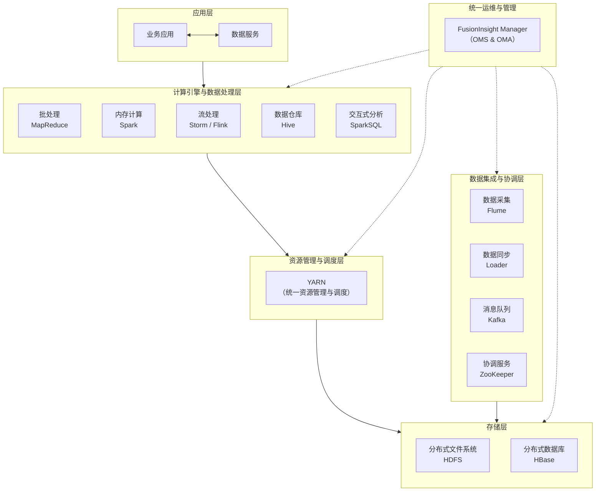

# 1、发放实例过程中的关键组件及其角色
**发放实例** 指的是创建这台虚拟机的**整个过程**。这个词比单纯的“创建”或“启动”含义更广，它包括了从用户发起请求到最终得到一个可用虚拟机的完整工作流。

让我们看看在像华为云Stack（基于OpenStack）这样的环境中，发放实例时有哪些主要组件参与：

1.  **Dashboard / CLI / API**：
    *   **角色**：**用户交互入口**。你通过在网页上点击按钮或运行命令，最终都会转化为一个标准的API调用请求。

2.  **Nova**：**计算服务**，是发放实例的**总指挥**。
    *   **接收请求**：它通过 API 接收到“创建一台XX配置的云服务器”的指令。
    *   **调度决策**：它的 **Scheduler** 子组件会从资源池中筛选出一台最合适的物理服务器来承载这个新实例。
    *   **协调工作**：**Nova 本身不直接处理网络和存储**，它会向**Neutron**和**Cinder**等服务下达指令，让它们配合完成工作。

3.  **Neutron**：**网络服务**。
    *   **角色**：负责一切网络相关事务。Nova 会通知 Neutron：“请为这个新实例分配一个IP，并连接到指定的虚拟网络（VPC）上，配置好安全组规则。”
    *   **题目关联**：你之前做对的题中，Router、Security Groups 这些高级网络功能就是由 Neutron 的 **Service Plugin** 实现的。

4.  **Cinder**：**块存储服务**。
    *   **角色**：负责提供和管理硬盘。Nova 会通知 Cinder：“请根据要求，创建一块虚拟硬盘，并挂载到新实例上。”

5.  **Glance**：**镜像服务**。
    *   **角色**：负责存储和管理操作系统模板（镜像）。Nova 会从 Glance 那里获取用户选择的系统镜像（如 CentOS, Windows），并以此为基础来创建实例的系统盘。

6.  **Keystone**：**身份认证服务**。
    *   **角色**：**云平台的“安全守门人”**。在整个发放过程中，上述所有组件之间的每次互相调用，都需要经过 Keystone 来验证身份和权限，确保“是合法的请求在访问合法的资源”。

7.  **TaskCenter / 组合API**：
    *   **角色**：**流程编排器**。对于复杂的发放流程（例如一次性创建多台关联的实例），这些组件负责将多个步骤串联起来，确保它们按正确顺序执行，并处理错误和回滚。
  


# 2、Hadoop 的生态系统(AI给的框架图，可能与实际不符合，但也大差不差)
重要题目
```
    ┌─────────────────────────────────┐
    │          Hadoop 生态系统         │
    └─────────────────────────────────┘
                  │
          ┌───────┴───────┐─────────────────┐
          │               │                 │
    ┌─────┴─────┐   ┌─────┴─────┐     ┌─────┴─────┐
    │   HDFS    │   │   YARN    │     │ zookeeper │                 # 基础平台层
    │ (存储层)   │   │(资源管理层)│    └───────────┘
    └───────────┘   └───────────┘
                         │
          ┌──────────────┼──────────────┐
          │              │              │
    ┌─────┴─────┐  ┌─────┴─────┐  ┌─────┴─────┐
    │ MapReduce │  │   Spark   │  │   Flink   │   # 计算框架层
    └───────────┘  └───────────┘  └───────────┘
          │              │              │
    ┌─────┴─────┐  ┌─────┴─────┐  ┌─────┴─────┐
    │   Hive    │  │ Spark SQL │  │ Flink SQL │   # 应用工具层
    │           │  │ Spark ML  │  │  Flink ML │
    └───────────┘  └───────────┘  └───────────┘
```
[1]HDFS:分布式文件系统，用于存储TB/PB级别的数据。
[2]Base:基于HDFS的NoSQL数据库，适合快速查询海量明细数据。
[3]YARN:进行**集群资源的管理**和**为多种分布式计算框架提供统一的资源管理平台**。
[4]Spark、Flink、Mapreduce：分布式计算引擎
[5]Hive ：构建在 Hadoop 之上的一个数据仓库工具。


虽然搜索结果里暂时没有找到特别清晰的FusionInsight HD整体架构图，不过我可以根据相关资料，为你梳理并绘制一个FusionInsight HD及其组件的逻辑结构示意图，帮助你理解其层次关系，并介绍核心组件。

> **请注意**：以下图表和说明主要基于几年前的公开资料。华为大数据平台技术持续演进，部分架构和组件信息可能已有更新。建议在实际应用或深入学习时，查阅华为官方的最新文档以获得最准确的信息。

下图展示了FusionInsight HD各逻辑层次的典型组件构成：

### 🗂️ 核心组件功能简介

下面表格简要介绍了架构图中一些核心组件的主要功能：

| 组件分类 | 组件名称 | 主要功能简介 |
| :--- | :--- | :--- |
| **统一运维与管理** | FusionInsight Manager | 提供集群的安装、监控、告警、用户管理、权限管理、服务管理等统一的运维管理能力。 |
| **资源管理与调度** | YARN | 统一的资源管理和调度平台，为上层各种计算应用分配计算资源（如CPU、内存）。 |
| **存储层** | HDFS | Hadoop分布式文件系统，提供高吞吐量数据访问，适合大规模数据集。 |
| | HBase | 构建在HDFS之上的分布式、面向列的NoSQL数据库，适用于海量数据的随机实时读写。 |
| **计算引擎与数据处理** | MapReduce | 分布式批处理计算模型，适合离线大规模数据处理。 |
| | Spark | 基于内存的分布式计算框架，常用于批处理、交互式查询和流处理。 |
| | SparkSQL | 基于Spark的SQL查询引擎，允许使用SQL语句处理结构化数据。 |
| | Hive | 数据仓库工具，可将结构化数据映射为数据库表，并提供HQL查询功能。 |
| | Storm / Flink | 流式处理引擎，用于处理实时数据流。 |
| **数据集成与协调** | Flume | 分布式、高可用的海量日志采集、聚合和传输系统。 |
| | Loader | 数据加载工具，支持在FusionInsight HD和关系型数据库、文件服务器之间批量导入/导出数据。 |
| | Kafka | 分布式消息发布-订阅系统，提供高吞吐量的实时数据消峰、解耦和传输。 |
| | ZooKeeper | 分布式应用协调服务，提供配置维护、命名服务、分布式同步等。 |

### 💡 架构与组件使用提示

- **层次化架构**：FusionInsight HD采用分层设计，从数据存储到上层应用，各层职责分明，方便系统扩展和维护。
- **组件协同工作**：实际业务场景中，多个组件常常协同完成复杂任务。例如，使用**Flume**采集日志到**Kafka**，**Spark Streaming**消费**Kafka**数据进行实时处理，处理结果存入**HBase**，最终通过**Hive**或**SparkSQL**进行离线分析。
- **统一管理入口**：**FusionInsight Manager**是管理整个集群的核心，通过其提供的Web UI，管理员可以方便地监控集群健康状态、管理服务实例、配置权限和查看审计日志等。

希望以上图解和说明能帮助你建立起对FusionInsight HD整体架构和组件关系的初步认识。

如果你对其中某个特定组件（比如负责数据同步的Loader，或者负责资源调度的YARN）的具体功能或应用场景特别感兴趣，我很乐意为你提供更详细的介绍。

## 疑惑解决
### 1、spark、flink和mapreduce的区别：
答：MapReduce（只支持批处理）、Spark（支持批处理和微批流处理）、Flink（支持流处理和批处理）三者都共同支持的处理方式是批处理。